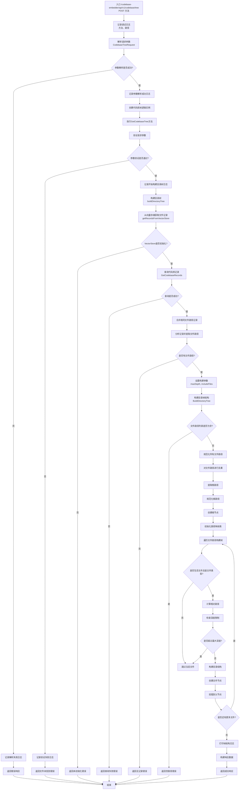

# /api/v1/codebase/tree 接口流程图

## 接口说明
代码库树结构接口用于获取指定代码库的目录树结构，支持自定义最大深度和是否包含文件的选项。

## 请求参数
- `ClientId`: 客户端标识
- `CodebasePath`: 代码库路径
- `CodebaseName`: 代码库名称
- `MaxDepth`: 最大深度（可选，默认为10）
- `IncludeFiles`: 是否包含文件（可选，默认为true）

## 响应数据
- `Code`: 响应状态码
- `Message`: 响应消息
- `Success`: 是否成功
- `Data`: 目录树结构数据

## 接口处理流程



## 详细处理步骤

### 1. 请求解析与验证
- 解析POST请求中的JSON参数
- 验证必填字段：ClientId、CodebasePath、CodebaseName
- 设置可选参数的默认值：MaxDepth（10）、IncludeFiles（true）

### 2. 数据获取与处理
- 从向量存储中获取代码库的所有文件记录
- 合并相同文件路径的记录，避免重复
- 提取所有文件路径用于构建树结构

### 3. 路径规范化与去重
- 对所有文件路径进行规范化处理（统一分隔符、去除冗余等）
- 对路径进行去重，避免重复处理
- 提取所有路径的公共前缀作为根路径

### 4. 目录树构建
- 创建根节点，使用提取的公共路径作为根
- 遍历所有文件路径，逐级构建目录结构
- 根据IncludeFiles参数决定是否添加文件节点
- 根据MaxDepth参数限制树的最大深度

### 5. 节点创建与挂载
- 为每个目录创建目录节点
- 为每个文件创建文件节点（如果启用）
- 将节点正确挂载到父节点下
- 维护路径映射表以便快速查找父节点

### 6. 响应构建与返回
- 打印构建完成的树结构用于调试
- 构建包含完整树结构的响应数据
- 返回成功响应

## 辅助功能说明

### 路径规范化
- 统一使用正斜杠作为路径分隔符
- 去除路径中的冗余分隔符
- 处理相对路径和绝对路径的转换

### 记录合并
- 将相同文件路径的多条记录合并为一条
- 合并内容、token数量和范围信息
- 保留最新的更新时间

### 深度控制
- 计算每个文件的相对深度
- 根据MaxDepth参数过滤过深的文件
- 确保树结构不会过于复杂

## 错误处理
- **参数错误**: 当必填字段缺失时返回400错误
- **数据错误**: 当向量存储未初始化或查询失败时返回相应错误
- **路径错误**: 当文件路径处理失败时返回相应错误
- **构建错误**: 当树结构构建失败时返回相应错误

## 性能优化
- 使用map进行路径查找，提高查找效率
- 批量处理文件路径，减少重复计算
- 合并相同路径的记录，减少处理量
- 合理设置默认深度限制，避免树结构过大

## 使用示例

### 请求示例
```json
{
  "ClientId": "client123",
  "CodebasePath": "/projects/myapp",
  "CodebaseName": "My Application",
  "MaxDepth": 5,
  "IncludeFiles": true
}
```

### 响应示例
```json
{
  "Code": 0,
  "Message": "ok",
  "Success": true,
  "Data": {
    "Name": "myapp",
    "Path": "/projects/myapp",
    "Type": "directory",
    "Children": [
      {
        "Name": "src",
        "Path": "/projects/myapp/src",
        "Type": "directory",
        "Children": [
          {
            "Name": "main.go",
            "Path": "/projects/myapp/src/main.go",
            "Type": "file",
            "Children": []
          }
        ]
      },
      {
        "Name": "README.md",
        "Path": "/projects/myapp/README.md",
        "Type": "file",
        "Children": []
      }
    ]
  }
}
```

## 调试信息
接口提供了详细的调试日志，包括：
- 请求参数解析过程
- 目录树构建参数
- 文件处理统计信息
- 树结构打印输出