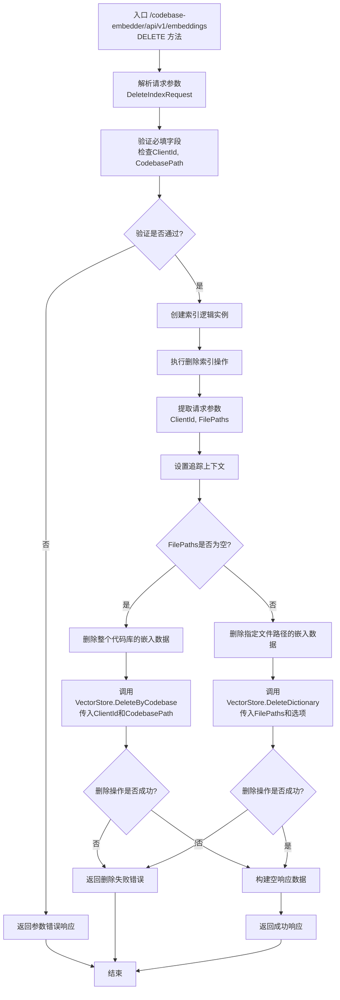

# /api/v1/embeddings 接口流程图（DELETE方法）

## 接口说明
删除嵌入向量接口用于从向量数据库中删除代码库的嵌入数据，支持删除整个代码库或指定文件路径的嵌入数据。

## 请求参数
- `ClientId`: 客户端标识
- `CodebasePath`: 代码库路径
- `FilePaths`: 文件路径列表（可选，为空时删除整个代码库）

## 接口处理流程



## 详细处理步骤

### 1. 请求解析与验证
- 解析DELETE请求中的JSON参数
- 验证必填字段：ClientId、CodebasePath
- FilePaths为可选参数，用于指定删除特定文件

### 2. 删除逻辑判断
- 检查FilePaths是否为空
- 如果FilePaths为空，执行整个代码库删除
- 如果FilePaths不为空，执行指定文件路径删除

### 3. 整个代码库删除
- 调用VectorStore.DeleteByCodebase方法
- 传入ClientId和CodebasePath参数
- 删除指定代码库的所有嵌入数据

### 4. 指定文件路径删除
- 调用VectorStore.DeleteDictionary方法
- 传入FilePaths和包含ClientId、CodebasePath的选项
- 删除指定文件路径的嵌入数据

### 5. 响应处理
- 删除成功时返回空响应数据
- 删除失败时返回包含错误信息的响应

## 错误处理
- **参数错误**: 当必填字段缺失或无效时返回400错误
- **删除失败**: 当向量数据库删除操作失败时返回500错误
- **系统错误**: 当其他系统异常发生时返回相应错误码

## 使用场景

### 场景1：删除整个代码库
```json
{
  "ClientId": "client123",
  "CodebasePath": "/projects/myapp",
  "FilePaths": ""
}
```
这将删除指定代码库的所有嵌入数据。

### 场景2：删除指定文件
```json
{
  "ClientId": "client123",
  "CodebasePath": "/projects/myapp",
  "FilePaths": "/projects/myapp/src/main.go,/projects/myapp/src/utils.go"
}
```
这将删除指定文件路径的嵌入数据，支持多个文件路径（逗号分隔）。

## 性能考虑
- 删除整个代码库操作可能耗时较长，取决于代码库大小
- 删除指定文件路径操作相对较快
- 建议在非高峰期执行大规模删除操作