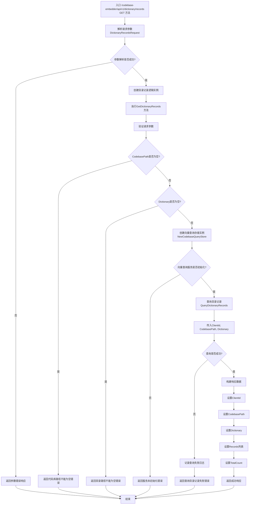

# /api/v1/dictionary/records 接口流程图

## 接口说明
目录记录查询接口用于获取指定目录的详细记录信息，包括目录下所有文件的索引信息和统计数据。

## 请求方式
- 方法：GET
- 路径：/codebase-embedder/api/v1/dictionary/records

## 请求参数
- `ClientId`: 客户端标识（可选）
- `CodebasePath`: 代码库路径
- `Dictionary`: 目录路径

## 响应数据
- `ClientId`: 客户端标识
- `CodebasePath`: 代码库路径
- `Dictionary`: 目录路径
- `Records`: 目录记录列表
- `TotalCount`: 记录总数

## 接口处理流程



## 详细处理步骤

### 1. 请求解析与验证
- 解析GET请求中的查询参数
- 验证必填字段：CodebasePath、Dictionary
- ClientId为可选参数，用于标识客户端

### 2. 服务初始化检查
- 创建向量查询存储实例
- 检查向量查询服务是否已正确初始化
- 确保服务可用后继续处理

### 3. 目录记录查询
- 调用QueryDictionaryRecords方法查询指定目录的记录
- 传入ClientId、CodebasePath、Dictionary参数
- 获取目录下所有文件的详细记录信息

### 4. 响应构建
- 构建包含目录记录的响应数据
- 设置请求的ClientId、CodebasePath和Dictionary
- 包含查询到的记录列表和记录总数

### 5. 响应返回
- 返回JSON格式的响应数据
- 包含目录的详细记录信息

## 目录记录结构

每个目录记录包含以下信息：
- 文件路径
- 文件类型
- 语言类型
- 文件大小
- 分块数量
- Token总数
- 最后索引时间
- 文件状态
- 嵌入向量统计信息

## 错误处理
- **参数错误**: 当必填字段缺失时返回400错误
- **服务错误**: 当向量查询服务未初始化时返回服务不可用错误
- **查询错误**: 当目录记录查询失败时返回内部错误

## 性能考虑
- 查询性能取决于向量数据库的响应速度
- 大目录的记录数据可能较多，建议合理使用
- 建议缓存常用目录的记录信息
- 查询结果包含详细数据，注意网络传输开销

## 使用示例

### 请求示例
```bash
GET /codebase-embedder/api/v1/dictionary/records?ClientId=client123&CodebasePath=/projects/myapp&Dictionary=/projects/myapp/src
```

### 成功响应示例
```json
{
  "ClientId": "client123",
  "CodebasePath": "/projects/myapp",
  "Dictionary": "/projects/myapp/src",
  "Records": [
    {
      "FilePath": "/projects/myapp/src/main.go",
      "FileType": "file",
      "Language": "go",
      "FileSize": 2048,
      "ChunkCount": 5,
      "TokenCount": 150,
      "LastIndexed": "2025-01-24T09:15:00Z",
      "Status": "indexed",
      "EmbeddingStats": {
        "VectorDimensions": 768,
        "SimilarityScore": 0.95
      }
    },
    {
      "FilePath": "/projects/myapp/src/utils",
      "FileType": "directory",
      "Language": "",
      "FileSize": 0,
      "ChunkCount": 0,
      "TokenCount": 0,
      "LastIndexed": "2025-01-24T09:15:00Z",
      "Status": "indexed",
      "EmbeddingStats": null
    },
    {
      "FilePath": "/projects/myapp/src/utils/helper.go",
      "FileType": "file",
      "Language": "go",
      "FileSize": 1024,
      "ChunkCount": 3,
      "TokenCount": 80,
      "LastIndexed": "2025-01-24T09:15:00Z",
      "Status": "indexed",
      "EmbeddingStats": {
        "VectorDimensions": 768,
        "SimilarityScore": 0.87
      }
    }
  ],
  "TotalCount": 3
}
```

### 错误响应示例
```json
{
  "Code": 400,
  "Message": "代码库路径不能为空",
  "Success": false
}
```

```json
{
  "Code": 400,
  "Message": "目录路径不能为空",
  "Success": false
}
```

```json
{
  "Code": 500,
  "Message": "向量查询服务未初始化",
  "Success": false
}
```

```json
{
  "Code": 500,
  "Message": "查询目录记录失败: 目录不存在",
  "Success": false
}
```

## 应用场景

### 目录分析工具
- 获取目录下所有文件的索引状态
- 分析目录结构和文件分布
- 用于代码库管理和优化

### 索引状态监控
- 检查目录内文件的索引完整性
- 监控索引更新状态
- 识别未索引或索引失败的文件

### 统计和报告
- 生成目录级别的统计报告
- 分析代码库的组成结构
- 用于项目管理和决策支持

## 与文件记录接口的区别

### 文件记录接口 (`/api/v1/files/records`)
- 查询单个文件的详细记录
- 返回文件的内容分块和向量数据
- 适合需要详细文件信息的场景

### 目录记录接口 (`/api/v1/dictionary/records`)
- 查询整个目录的记录信息
- 返回目录下所有文件的概要信息
- 适合需要目录级别统计和管理的场景

## 注意事项
- 此接口返回目录下所有文件的记录，数据量可能较大
- 建议在需要目录级别信息时使用，避免频繁调用
- 目录路径需要完整路径，不支持模糊匹配
- 查询结果按文件路径排序
- 如果目录不存在或未索引，返回空记录列表
- 大目录的查询可能需要较长时间，考虑异步处理
- 建议合理设置查询频率，避免对系统造成过大压力