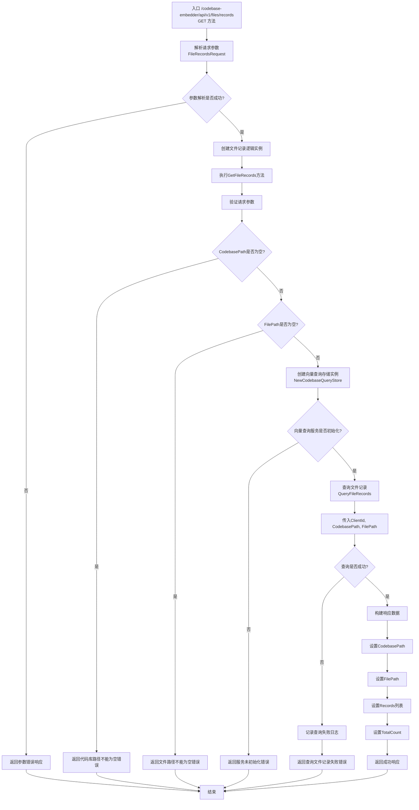

# /api/v1/files/records 接口流程图

## 接口说明
文件记录查询接口用于获取指定文件的详细记录信息，包括文件的向量嵌入数据、分块信息等详细内容。

## 请求方式
- 方法：GET
- 路径：/codebase-embedder/api/v1/files/records

## 请求参数
- `ClientId`: 客户端标识
- `CodebasePath`: 代码库路径
- `FilePath`: 文件路径

## 响应数据
- `CodebasePath`: 代码库路径
- `FilePath`: 文件路径
- `Records`: 文件记录列表
- `TotalCount`: 记录总数

## 接口处理流程



## 详细处理步骤

### 1. 请求解析与验证
- 解析GET请求中的查询参数
- 验证必填字段：CodebasePath、FilePath
- ClientId为可选参数，用于标识客户端

### 2. 服务初始化检查
- 创建向量查询存储实例
- 检查向量查询服务是否已正确初始化
- 确保服务可用后继续处理

### 3. 文件记录查询
- 调用QueryFileRecords方法查询指定文件的记录
- 传入ClientId、CodebasePath、FilePath参数
- 获取文件的详细记录信息

### 4. 响应构建
- 构建包含文件记录的响应数据
- 设置请求的CodebasePath和FilePath
- 包含查询到的记录列表和记录总数

### 5. 响应返回
- 返回JSON格式的响应数据
- 包含文件的详细记录信息

## 文件记录结构

每个文件记录包含以下信息：
- 记录ID
- 文件路径
- 语言类型
- 内容分块
- Token数量
- 向量嵌入数据
- 创建时间
- 更新时间
- 分块范围信息

## 错误处理
- **参数错误**: 当必填字段缺失时返回400错误
- **服务错误**: 当向量查询服务未初始化时返回服务不可用错误
- **查询错误**: 当文件记录查询失败时返回内部错误

## 性能考虑
- 查询性能取决于向量数据库的响应速度
- 大文件的记录数据可能较多，建议合理使用
- 建议缓存常用文件的记录信息
- 查询结果包含详细数据，注意网络传输开销

## 使用示例

### 请求示例
```bash
GET /codebase-embedder/api/v1/files/records?ClientId=client123&CodebasePath=/projects/myapp&FilePath=/projects/myapp/src/main.go
```

### 成功响应示例
```json
{
  "CodebasePath": "/projects/myapp",
  "FilePath": "/projects/myapp/src/main.go",
  "Records": [
    {
      "Id": "record_001",
      "FilePath": "/projects/myapp/src/main.go",
      "Language": "go",
      "Content": "package main\n\nimport \"fmt\"\n\nfunc main() {\n    fmt.Println(\"Hello, World!\")\n}",
      "TokenCount": 25,
      "ChunkStart": 0,
      "ChunkEnd": 67,
      "Embedding": [0.1, 0.2, 0.3, ...],
      "CreatedAt": "2025-01-24T09:15:00Z",
      "UpdatedAt": "2025-01-24T09:15:00Z"
    },
    {
      "Id": "record_002",
      "FilePath": "/projects/myapp/src/main.go",
      "Language": "go",
      "Content": "type User struct {\n    Name string\n    Age  int\n}",
      "TokenCount": 18,
      "ChunkStart": 68,
      "ChunkEnd": 110,
      "Embedding": [0.4, 0.5, 0.6, ...],
      "CreatedAt": "2025-01-24T09:15:00Z",
      "UpdatedAt": "2025-01-24T09:15:00Z"
    }
  ],
  "TotalCount": 2
}
```

### 错误响应示例
```json
{
  "Code": 400,
  "Message": "代码库路径不能为空",
  "Success": false
}
```

```json
{
  "Code": 500,
  "Message": "向量查询服务未初始化",
  "Success": false
}
```

```json
{
  "Code": 500,
  "Message": "查询文件记录失败: 文件不存在",
  "Success": false
}
```

## 应用场景

### 代码分析工具
- 获取文件的详细分块信息
- 分析代码结构和内容分布
- 用于代码理解和重构

### 调试和诊断
- 检查文件是否正确索引
- 验证向量嵌入数据质量
- 排查搜索结果不准确的问题

### 数据导出
- 导出文件的向量数据
- 备份重要的文件记录
- 用于数据迁移和分析

## 注意事项
- 此接口返回详细的文件记录数据，数据量可能较大
- 建议在需要详细数据时使用，避免频繁调用
- 文件路径需要完整路径，不支持模糊匹配
- 查询结果按分块顺序排列
- 如果文件不存在或未索引，返回空记录列表
- 大文件的记录数据可能分页返回，考虑性能优化