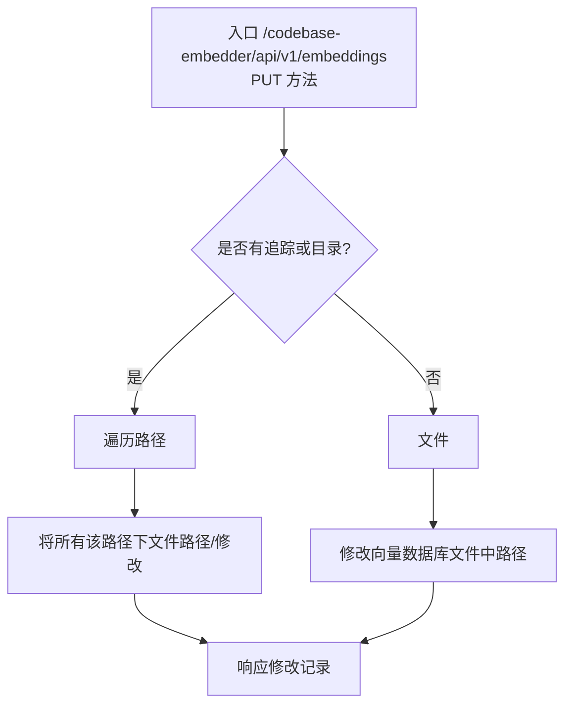

```mermaid
flowchart TD
    A[入口 /codebase-embedder/api/v1/embeddings<br>PUT 方法] --> B{是否有追踪或目录?}
    B -->|是| C[遍历路径]
    B -->|否| D[文件]
    C --> E[将所有该路径下文件路径/修改]
    E --> F[响应修改记录]
    D --> G[修改向量数据库文件中路径]
    G --> F
```