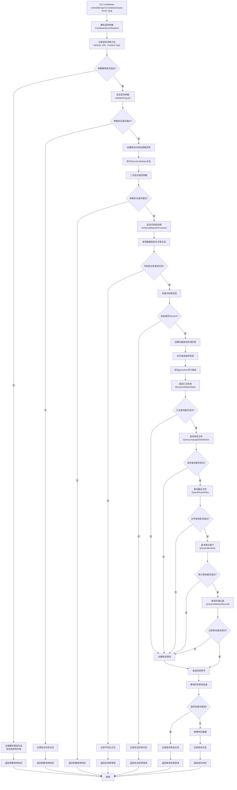

# /api/v1/codebase/query 接口流程图

## 接口说明
代码库查询接口用于获取指定代码库的详细信息，包括汇总信息、语言分布、最近文件、索引统计和详细记录等。

## 请求参数
- `ClientId`: 客户端标识
- `CodebasePath`: 代码库路径
- `CodebaseName`: 代码库名称

## 响应数据
- `CodebaseId`: 代码库ID
- `CodebaseName`: 代码库名称
- `CodebasePath`: 代码库路径
- `Summary`: 代码库汇总信息
- `LanguageDist`: 语言分布统计
- `RecentFiles`: 最近文件列表
- `IndexStats`: 索引统计信息
- `Records`: 详细记录列表

## 接口处理流程



## 详细处理步骤

### 1. 请求解析与验证
- 解析POST请求中的JSON参数
- 记录详细的请求日志（方法、URL、Content-Type）
- 验证必填字段：ClientId、CodebasePath、CodebaseName

### 2. 权限验证
- 查询数据库验证ClientId与Codebase的关联关系
- 检查代码库状态是否为"active"
- 确保用户有权限访问指定代码库

### 3. 并行查询
使用goroutine并行查询以下信息以提高性能：
- **汇总信息**: 代码库的基本统计信息
- **语言分布**: 各种编程语言的占比统计
- **最近文件**: 最近修改或添加的文件列表
- **索引统计**: 向量索引的统计信息
- **详细记录**: 代码库的详细记录列表

### 4. 响应构建
- 整合所有查询结果
- 构建完整的响应数据结构
- 记录查询成功日志

## 错误处理
- **参数错误**: 当必填字段缺失或无效时返回400错误
- **权限错误**: 当代码库不存在或用户无权限访问时返回403错误
- **状态错误**: 当代码库状态不正常时返回相应错误
- **查询错误**: 当向量数据库查询失败时返回500错误

## 性能优化
- 使用goroutine并行查询多个数据源
- 查询失败时立即终止其他查询
- 合理设置最近文件查询数量（默认10个）
- 记录详细的性能日志用于监控

## 使用示例

### 请求示例
```json
{
  "ClientId": "client123",
  "CodebasePath": "/projects/myapp",
  "CodebaseName": "My Application"
}
```

### 响应示例
```json
{
  "CodebaseId": 123,
  "CodebaseName": "My Application",
  "CodebasePath": "/projects/myapp",
  "Summary": {
    "TotalChunks": 1500,
    "TotalFiles": 200,
    "TotalLines": 50000
  },
  "LanguageDist": [
    {
      "Language": "Go",
      "Percentage": 65.5,
      "FileCount": 130
    },
    {
      "Language": "JavaScript",
      "Percentage": 20.3,
      "FileCount": 41
    }
  ],
  "RecentFiles": [
    {
      "Path": "/projects/myapp/src/main.go",
      "LastModified": "2025-01-24T10:30:00Z",
      "Size": 2048
    }
  ],
  "IndexStats": {
    "IndexedFiles": 195,
    "TotalVectors": 1480,
    "LastIndexed": "2025-01-24T09:15:00Z"
  },
  "Records": [
    {
      "FilePath": "/projects/myapp/src/main.go",
      "Language": "Go",
      "ChunkCount": 15,
      "LastIndexed": "2025-01-24T09:15:00Z"
    }
  ]
}