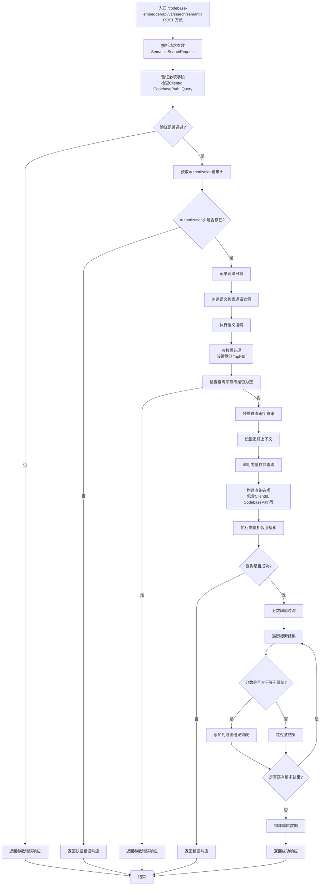

# /api/v1/search/semantic 接口流程图

## 接口说明
语义搜索接口用于在代码库中执行基于语义的代码搜索，通过向量相似度匹配找到相关的代码片段。

## 请求参数
- `ClientId`: 客户端标识
- `CodebasePath`: 代码库路径
- `Query`: 搜索查询字符串
- `TopK`: 返回结果数量（可选，默认为5）
- `ScoreThreshold`: 分数阈值（可选，用于过滤低相似度结果）

## 接口处理流程

## 详细处理步骤

### 1. 请求解析与验证
- 解析POST请求中的JSON参数
- 验证必填字段：ClientId、CodebasePath、Query
- 检查Authorization请求头是否存在

### 2. 参数预处理
- 设置默认TopK值（最小为1，默认为5）
- 执行查询字符串预处理（去除特殊字符、敏感词过滤等）

### 3. 向量搜索
- 构建查询选项，包含客户端信息和代码库路径
- 调用向量存储服务执行相似度搜索
- 获取基于语义相似度的代码片段列表

### 4. 结果过滤
- 根据ScoreThreshold过滤低相似度结果
- 只保留分数大于等于阈值的代码片段
- 构建最终响应数据

### 5. 响应返回
- 返回过滤后的语义搜索结果列表
- 每个结果包含代码片段信息、相似度分数等

## 错误处理
- **参数错误**: 当必填字段缺失或无效时返回400错误
- **认证错误**: 当Authorization头缺失时返回401错误
- **系统错误**: 当向量搜索服务异常时返回500错误

## 性能考虑
- 向量搜索性能取决于向量数据库的响应速度
- 结果过滤在内存中进行，影响较小
- 建议合理设置TopK值以平衡结果质量和性能