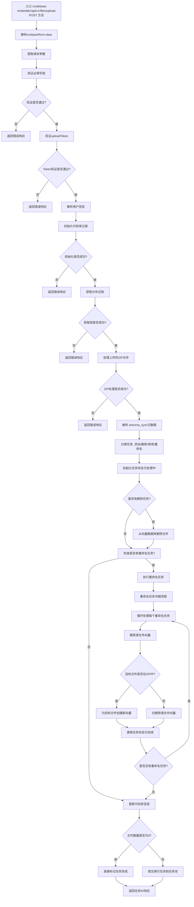

# /api/v1/files/upload 接口流程图

## .shenma_sync 元数据格式

`.shenma_sync` 文件是 ZIP 包中的同步元数据文件，用于描述文件操作类型和相关信息。支持两种不同的 JSON 格式：

## 格式一：对象格式

```json
{
  "clientId": "客户端标识",
  "codebasePath": "代码库路径",
  "codebaseName": "代码库名称",
  "extraMetadata": {
    "自定义键值对": "值"
  },
  "fileList": {
    "文件路径1": "add",
    "文件路径2": "modify",
    "文件路径3": "delete"
  },
  "timestamp": 时间戳
}
```

### 格式二：数组格式

```json
{
  "clientId": "客户端标识",
  "codebasePath": "代码库路径",
  "codebaseName": "代码库名称",
  "extraMetadata": {
    "自定义键值对": "值"
  },
  "fileList": [
    {
      "path": "文件路径1",
      "targetPath": "",
      "hash": "文件哈希值1",
      "status": "add",
      "requestId": ""
    },
    {
      "path": "文件路径2",
      "targetPath": "",
      "hash": "文件哈希值2",
      "status": "modify",
      "requestId": ""
    },
    {
      "path": "文件路径3",
      "targetPath": "",
      "hash": "文件哈希值3",
      "status": "delete",
      "requestId": ""
    }
    {
      "path": "test/codegraph/java_test.go",
      "targetPath": "test/codegraph/java_test2.go",
      "hash": "1754987375674",
      "status": "rename",
      "requestId": ""
    },
    {
      "path": "test/codegraph",
      "targetPath": "test/codegraph2",
      "hash": "1754987375674",
      "status": "rename",
      "requestId": ""
    }
  ],

  "timestamp": 时间戳
}
```

### fileList 支持的操作类型：
- **add**: 添加新文件到向量数据库
- **modify**: 修改现有文件的向量数据
- **delete**: 从向量数据库删除文件
- **rename**: 重命名文件或目录，包括删除源文件向量并为目标文件创建新向量

### 格式说明：
- **格式一** 使用键值对方式，键为文件路径，值为操作类型
- **格式二** 使用数组方式，每个元素包含文件详细信息：
  - `path`: 文件路径（必需）
  - `targetPath`: 目标路径（可选）
  - `hash`: 文件哈希值（可选）
  - `status`: 操作类型（优先使用）
  - `operate`: 操作类型（备用字段，当status不存在时使用）
  - `requestId`: 请求ID（可选）

## 接口处理流程

