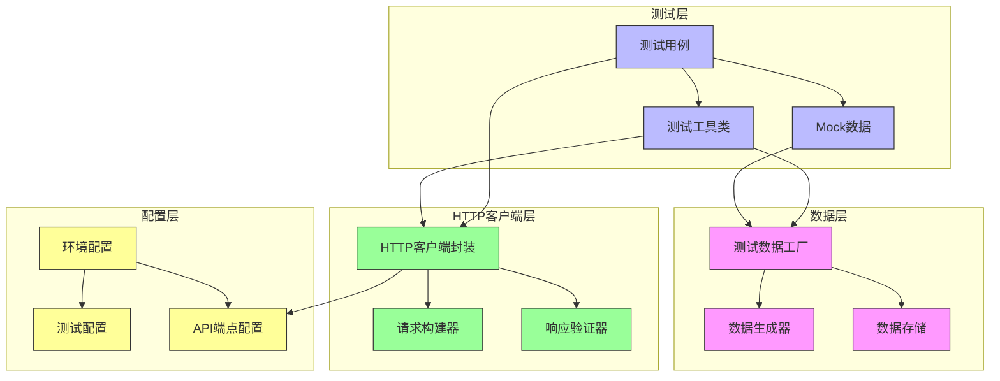

# Python测试代码技术架构设计文档

## 1. 设计概述

### 1.1 设计目标
基于Codebase Embedder项目的API接口文档，设计一套完整的Python测试代码架构，为8个核心API接口提供全面的测试覆盖，确保接口功能的正确性、稳定性和可靠性。

### 1.2 设计范围
- 为8个API接口设计测试用例：提交嵌入任务、删除嵌入数据、获取代码库摘要、服务状态检查、语义代码搜索、文件状态查询、文件上传接口和查询代码库信息
- 设计测试框架选择、文件结构组织、测试用例设计方法
- 制定依赖库选择、Mock策略、测试数据管理和测试报告生成方案
- 提供可扩展、易维护的测试架构设计

## 2. 技术方案

### 2.1 技术栈选择

| 组件 | 技术 | 版本 | 选择理由 |
|------|------|------|----------|
| 测试框架 | pytest | 7.4+ | 功能强大，插件丰富，支持并行测试，社区活跃 |
| HTTP客户端 | httpx | 0.25+ | 支持同步/异步请求，API友好，性能优秀 |
| Mock库 | pytest-mock | 3.12+ | 与pytest深度集成，提供简洁的Mock API |
| 数据验证 | pydantic | 2.5+ | 强类型数据验证，支持JSON Schema |
| 异步支持 | pytest-asyncio | 0.21+ | 支持异步测试用例 |
| 测试报告 | pytest-html | 4.1+ | 生成HTML格式测试报告 |
| 覆盖率 | pytest-cov | 4.1+ | 代码覆盖率统计 |
| 环境管理 | python-dotenv | 1.0+ | 管理测试环境变量 |
| 数据生成 | faker | 20.1+ | 生成随机测试数据 |

### 2.2 方案对比

#### 2.2.1 测试框架选择

| 框架 | 优点 | 缺点 | 适用场景 |
|------|------|------|----------|
| pytest | 插件丰富，语法简洁，支持参数化，并行测试 | 学习曲线稍陡 | 复杂API测试，需要高级功能 |
| unittest | Python标准库，IDE集成好 | 语法冗长，功能有限 | 简单测试，标准库依赖 |
| nose2 | 兼容unittest，插件系统 | 社区活跃度低 | 遗留项目维护 |

**选择理由**：pytest提供了最全面的测试功能，特别是参数化测试、fixture系统和丰富的插件生态，非常适合API测试场景。

#### 2.2.2 HTTP客户端选择

| 客户端 | 优点 | 缺点 | 适用场景 |
|--------|------|------|----------|
| httpx | 支持同步/异步，现代API，性能好 | 相对较新，社区较小 | 现代Web API测试 |
| requests | 成熟稳定，文档完善，社区大 | 不支持异步，性能一般 | 传统同步测试 |
| aiohttp | 高性能异步支持 | API复杂，同步支持差 | 纯异步测试场景 |

**选择理由**：httpx作为requests的现代替代品，提供了同步/异步双模式支持，API设计更加现代化，性能优秀，是未来发展的趋势。

## 3. 详细设计

### 3.1 系统架构图



### 3.2 测试文件结构

```
tests/
├── __init__.py
├── conftest.py                 # pytest配置和fixtures
├── pytest.ini                 # pytest配置文件
├── requirements.txt           # 测试依赖
├── .env                       # 环境变量
├── .env.example               # 环境变量示例
│
├── api/                       # API测试目录
│   ├── __init__.py
│   ├── conftest.py
│   ├── test_embeddings.py     # 嵌入任务相关测试
│   ├── test_search.py         # 搜索相关测试
│   ├── test_files.py          # 文件相关测试
│   ├── test_status.py         # 状态相关测试
│   └── test_codebase.py       # 代码库相关测试
│
├── utils/                     # 工具类
│   ├── __init__.py
│   ├── http_client.py         # HTTP客户端封装
│   ├── data_factory.py        # 测试数据工厂
│   ├── assertions.py          # 自定义断言
│   ├── mock_server.py         # Mock服务器
│   └── fixtures.py            # 测试fixtures
│
├── data/                      # 测试数据
│   ├── test_files/            # 测试文件
│   │   ├── sample_project.zip
│   │   └── .shenma_sync/
│   ├── schemas/               # JSON Schema
│   │   ├── embeddings_schema.json
│   │   ├── search_schema.json
│   │   └── ...
│   └── fixtures/              # 测试固件数据
│       ├── valid_requests.json
│       └── expected_responses.json
│
└── reports/                   # 测试报告
    ├── html/                  # HTML报告
    ├── coverage/              # 覆盖率报告
    └── logs/                  # 测试日志
```

### 3.3 核心模块设计

#### 3.3.1 HTTP客户端封装

```python
# utils/http_client.py
import httpx
from typing import Dict, Any, Optional, Union
from pydantic import BaseModel
import json

class APIClient:
    def __init__(self, base_url: str, timeout: int = 30):
        self.base_url = base_url.rstrip('/')
        self.timeout = timeout
        self.client = httpx.Client(timeout=timeout)
        self.headers = {
            'Content-Type': 'application/json',
            'User-Agent': 'Codebase-Embedder-Test/1.0'
        }
    
    async def __aenter__(self):
        self.async_client = httpx.AsyncClient(timeout=self.timeout)
        return self
    
    async def __aexit__(self, exc_type, exc_val, exc_tb):
        await self.async_client.aclose()
    
    def set_auth(self, token: str):
        """设置认证令牌"""
        self.headers['Authorization'] = f'Bearer {token}'
    
    def request(self, method: str, endpoint: str, **kwargs) -> httpx.Response:
        """发送HTTP请求"""
        url = f"{self.base_url}{endpoint}"
        response = self.client.request(method, url, headers=self.headers, **kwargs)
        return response
    
    async def async_request(self, method: str, endpoint: str, **kwargs) -> httpx.Response:
        """发送异步HTTP请求"""
        url = f"{self.base_url}{endpoint}"
        response = await self.async_client.request(method, url, headers=self.headers, **kwargs)
        return response
    
    def get(self, endpoint: str, **kwargs) -> httpx.Response:
        return self.request('GET', endpoint, **kwargs)
    
    def post(self, endpoint: str, **kwargs) -> httpx.Response:
        return self.request('POST', endpoint, **kwargs)
    
    def put(self, endpoint: str, **kwargs) -> httpx.Response:
        return self.request('PUT', endpoint, **kwargs)
    
    def delete(self, endpoint: str, **kwargs) -> httpx.Response:
        return self.request('DELETE', endpoint, **kwargs)
```

#### 3.3.2 测试数据工厂

```python
# utils/data_factory.py
from faker import Faker
from typing import Dict, Any, List, Optional
import json
import zipfile
import tempfile
import os
from datetime import datetime

fake = Faker('zh_CN')

class TestDataFactory:
    """测试数据工厂类"""
    
    @staticmethod
    def generate_client_id() -> str:
        """生成客户端ID"""
        return f"client_{fake.uuid4()}"
    
    @staticmethod
    def generate_codebase_path() -> str:
        """生成代码库路径"""
        return f"/home/user/projects/{fake.word()}"
    
    @staticmethod
    def generate_codebase_name() -> str:
        """生成代码库名称"""
        return f"{fake.word()}-{fake.word()}"
    
    @staticmethod
    def generate_upload_token() -> str:
        """生成上传令牌"""
        return "xxxx"  # 调试阶段使用固定令牌
    
    @staticmethod
    def generate_sync_metadata() -> Dict[str, Any]:
        """生成同步元数据"""
        return {
            "clientId": TestDataFactory.generate_client_id(),
            "codebasePath": TestDataFactory.generate_codebase_path(),
            "codebaseName": TestDataFactory.generate_codebase_name(),
            "extraMetadata": {},
            "fileList": {
                "src/main.py": "add",
                "src/utils.py": "add",
                "README.md": "add"
            },
            "timestamp": int(datetime.now().timestamp())
        }
    
    @staticmethod
    def create_sample_zip_file() -> str:
        """创建示例ZIP文件"""
        temp_zip = tempfile.NamedTemporaryFile(delete=False, suffix='.zip')
        
        with zipfile.ZipFile(temp_zip.name, 'w') as zipf:
            # 添加.shenma_sync文件夹和元数据文件
            sync_content = json.dumps(TestDataFactory.generate_sync_metadata())
            zipf.writestr('.shenma_sync/' + str(int(datetime.now().timestamp())), sync_content)
            
            # 添加示例代码文件
            files = {
                'src/main.py': 'print("Hello, World!")',
                'src/utils.py': 'def helper():\n    return "helper"',
                'README.md': '# Sample Project\n\nThis is a sample project for testing.'
            }
            
            for file_path, content in files.items():
                zipf.writestr(file_path, content)
        
        return temp_zip.name
    
    @staticmethod
    def generate_embedding_request() -> Dict[str, Any]:
        """生成嵌入任务请求"""
        return {
            "clientId": TestDataFactory.generate_client_id(),
            "codebasePath": TestDataFactory.generate_codebase_path(),
            "codebaseName": TestDataFactory.generate_codebase_name(),
            "uploadToken": TestDataFactory.generate_upload_token(),
            "fileTotals": 3,
            "extraMetadata": {"env": "test"}
        }
    
    @staticmethod
    def generate_search_query() -> str:
        """生成搜索查询"""
        queries = [
            "用户认证逻辑",
            "数据库连接",
            "API接口实现",
            "文件处理",
            "错误处理"
        ]
        return fake.random_element(queries)
```

#### 3.3.3 自定义断言

```python
# utils/assertions.py
import json
from typing import Dict, Any, List
from pydantic import BaseModel, ValidationError
import jsonschema

class APIAssertions:
    """API测试断言工具类"""
    
    @staticmethod
    def assert_status_code(response, expected_status: int):
        """断言状态码"""
        assert response.status_code == expected_status, \
            f"Expected status {expected_status}, got {response.status_code}. Response: {response.text}"
    
    @staticmethod
    def assert_json_response(response):
        """断言响应为JSON格式"""
        try:
            return response.json()
        except json.JSONDecodeError:
            raise AssertionError(f"Response is not valid JSON: {response.text}")
    
    @staticmethod
    def assert_response_schema(data: Dict[str, Any], schema: Dict[str, Any]):
        """断言响应符合JSON Schema"""
        try:
            jsonschema.validate(data, schema)
        except jsonschema.ValidationError as e:
            raise AssertionError(f"Response schema validation failed: {e.message}")
    
    @staticmethod
    def assert_response_contains(data: Dict[str, Any], key: str, expected_value: Any = None):
        """断言响应包含指定键"""
        assert key in data, f"Response does not contain key '{key}'. Keys: {list(data.keys())}"
        if expected_value is not None:
            assert data[key] == expected_value, \
                f"Expected value '{expected_value}' for key '{key}', got '{data[key]}'"
    
    @staticmethod
    def assert_response_time(response, max_time_ms: int):
        """断言响应时间"""
        response_time_ms = response.elapsed.total_seconds() * 1000
        assert response_time_ms <= max_time_ms, \
            f"Response time {response_time_ms}ms exceeds maximum {max_time_ms}ms"
    
    @staticmethod
    def assert_error_response(response, expected_code: int, expected_message: str = None):
        """断言错误响应"""
        APIAssertions.assert_status_code(response, expected_code)
        data = APIAssertions.assert_json_response(response)
        
        if expected_message:
            assert expected_message in data.get('message', ''), \
                f"Expected error message '{expected_message}' not found in '{data.get('message', '')}'"
    
    @staticmethod
    def assert_success_response(response, expected_data_keys: List[str] = None):
        """断言成功响应"""
        APIAssertions.assert_status_code(response, 200)
        data = APIAssertions.assert_json_response(response)
        
        assert data.get('success') is True, f"Expected success=true, got success={data.get('success')}"
        
        if expected_data_keys:
            if 'data' in data:
                for key in expected_data_keys:
                    assert key in data['data'], f"Expected key '{key}' not found in response data"
```

### 3.4 测试用例设计方法

#### 3.4.1 参数化测试设计

```python
# api/test_embeddings.py
import pytest
from utils.data_factory import TestDataFactory
from utils.assertions import APIAssertions
from utils.http_client import APIClient

class TestEmbeddings:
    """嵌入任务测试类"""
    
    @pytest.mark.parametrize("method,endpoint,expected_status", [
        ("GET", "/codebase-embedder/api/v1/status", 200),
        ("POST", "/codebase-embedder/api/v1/embeddings", 200),
        ("GET", "/codebase-embedder/api/v1/embeddings/summary", 200),
        ("DELETE", "/codebase-embedder/api/v1/embeddings", 200),
    ])
    def test_api_endpoints_accessibility(self, api_client: APIClient, method, endpoint, expected_status):
        """测试API端点可访问性"""
        response = getattr(api_client, method.lower())(endpoint)
        APIAssertions.assert_status_code(response, expected_status)
    
    @pytest.mark.parametrize("missing_field", [
        "clientId",
        "codebasePath", 
        "codebaseName",
        "fileTotals"
    ])
    def test_embedding_task_missing_required_fields(self, api_client: APIClient, missing_field):
        """测试缺少必填字段的嵌入任务"""
        request_data = TestDataFactory.generate_embedding_request()
        del request_data[missing_field]
        
        response = api_client.post("/codebase-embedder/api/v1/embeddings", json=request_data)
        APIAssertions.assert_status_code(response, 400)
    
    @pytest.mark.parametrize("client_id,codebase_path,codebase_name", [
        ("client_1", "/path/to/project1", "project1"),
        ("client_2", "/path/to/project2", "project2"),
        ("client_3", "/path/to/project3", "project3"),
    ])
    def test_embedding_task_different_projects(self, api_client: APIClient, client_id, codebase_path, codebase_name):
        """测试不同项目的嵌入任务"""
        request_data = {
            "clientId": client_id,
            "codebasePath": codebase_path,
            "codebaseName": codebase_name,
            "uploadToken": "xxxx",
            "fileTotals": 3
        }
        
        response = api_client.post("/codebase-embedder/api/v1/embeddings", json=request_data)
        APIAssertions.assert_status_code(response, 200)
```

#### 3.4.2 测试场景分类

```python
# api/test_search.py
import pytest
from utils.data_factory import TestDataFactory
from utils.assertions import APIAssertions
from utils.http_client import APIClient

class TestSemanticSearch:
    """语义搜索测试类"""
    
    # 正常场景测试
    def test_semantic_search_valid_query(self, api_client: APIClient, test_codebase):
        """测试有效的语义搜索查询"""
        params = {
            "clientId": test_codebase["clientId"],
            "projectPath": test_codebase["codebasePath"],
            "query": "用户认证逻辑",
            "topK": 5
        }
        
        response = api_client.get("/codebase-embedder/api/v1/search/semantic", params=params)
        APIAssertions.assert_status_code(response, 200)
        
        data = response.json()
        assert "list" in data
        assert isinstance(data["list"], list)
        
        for result in data["list"]:
            assert "content" in result
            assert "filePath" in result
            assert "score" in result
            assert isinstance(result["score"], (int, float))
            assert 0 <= result["score"] <= 1
    
    # 边界条件测试
    @pytest.mark.parametrize("top_k,score_threshold", [
        (1, 0.9),
        (10, 0.5),
        (20, 0.1),
        (0, 0.0),
        (100, 1.0)
    ])
    def test_semantic_search_boundary_conditions(self, api_client: APIClient, test_codebase, top_k, score_threshold):
        """测试语义搜索边界条件"""
        params = {
            "clientId": test_codebase["clientId"],
            "projectPath": test_codebase["codebasePath"],
            "query": "API接口",
            "topK": top_k,
            "scoreThreshold": score_threshold
