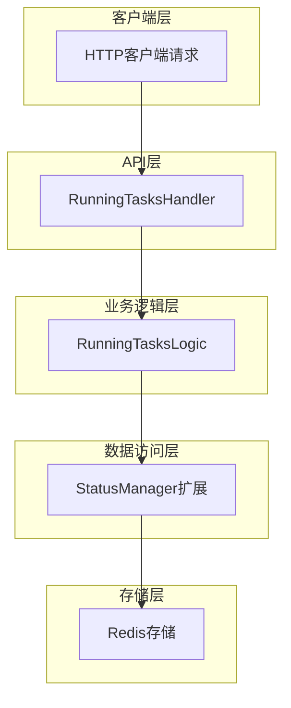
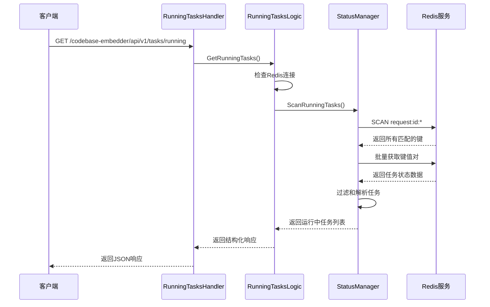

# 正在执行任务状态查询GET接口实现计划

## 1. 概述

基于产品需求文档和技术设计方案，本计划详细说明了正在执行任务状态查询GET接口的实现步骤。该接口将从Redis中获取所有正在执行的任务情况，支持任务状态过滤、排序和聚合。

## 2. 架构设计

### 2.1 整体架构图



### 2.2 数据流程图



## 3. 实现步骤

### 3.1 扩展数据类型定义

**文件位置**: `internal/types/running_tasks.go`

#### 3.1.1 数据结构设计

```go
package types

import "time"

// RunningTaskInfo 运行中任务信息
type RunningTaskInfo struct {
    TaskId                  string     `json:"taskId"`                  // 任务ID
    ClientId                string     `json:"clientId"`                // 客户端ID
    Status                  string     `json:"status"`                  // 任务状态
    Process                 string     `json:"process"`                 // 处理进程
    TotalProgress           int        `json:"totalProgress"`           // 总进度
    StartTime               time.Time  `json:"startTime"`               // 开始时间
    LastUpdateTime          time.Time  `json:"lastUpdateTime"`          // 最后更新时间
    EstimatedCompletionTime *time.Time `json:"estimatedCompletionTime,omitempty"` // 预计完成时间
    FileList                []FileStatusItem `json:"fileList"`         // 文件列表
}

// RunningTasksResponse 运行中任务查询响应
type RunningTasksResponse struct {
    Code    int               `json:"code"`    // 响应码
    Message string            `json:"message"` // 响应消息
    Success bool              `json:"success"` // 是否成功
    Data    *RunningTasksData `json:"data"`    // 任务数据
}

// RunningTasksData 运行中任务数据
type RunningTasksData struct {
    TotalTasks int                `json:"totalTasks"` // 任务总数
    Tasks      []RunningTaskInfo  `json:"tasks"`      // 任务列表
}
```

### 3.2 扩展Redis状态管理器

**文件位置**: `internal/store/redis/status_manager.go`

#### 3.2.1 添加扫描功能

```go
// ScanRunningTasks 扫描运行中的任务
func (sm *StatusManager) ScanRunningTasks(ctx context.Context) ([]RunningTaskInfo, error) {
    var runningTasks []RunningTaskInfo
    
    // 使用SCAN命令避免阻塞
    iter := sm.client.Scan(ctx, 0, "request:id:*", 0).Iterator()
    for iter.Next(ctx) {
        key := iter.Val()
        
        // 获取任务状态数据
        data, err := sm.client.Get(ctx, key).Result()
        if err != nil {
            if err == redis.Nil {
                continue // 键可能已过期
            }
            return nil, fmt.Errorf("failed to get task data for key %s: %w", key, err)
        }
        
        // 解析任务状态
        var status FileStatusResponseData
        if err := json.Unmarshal([]byte(data), &status); err != nil {
            continue // 跳过格式错误的数据
        }
        
        // 过滤运行中的任务状态
        if sm.isRunningStatus(status.Process) {
            taskInfo, err := sm.parseTaskInfo(key, status)
            if err != nil {
                continue
            }
            runningTasks = append(runningTasks, taskInfo)
        }
    }
    
    if err := iter.Err(); err != nil {
        return nil, fmt.Errorf("redis scan error: %w", err)
    }
    
    // 按开始时间排序
    sort.Slice(runningTasks, func(i, j int) bool {
        return runningTasks[i].StartTime.After(runningTasks[j].StartTime)
    })
    
    return runningTasks, nil
}

// isRunningStatus 检查是否为运行中的状态
func (sm *StatusManager) isRunningStatus(status string) bool {
    return status == "pending" || status == "processing" || status == "running"
}

// parseTaskInfo 解析任务信息
func (sm *StatusManager) parseTaskInfo(key string, status FileStatusResponseData) (RunningTaskInfo, error) {
    // 从key中提取任务ID
    taskId := strings.TrimPrefix(key, "request:id:")
    
    // 解析任务状态数据中的时间信息
    var startTime, lastUpdateTime time.Time
    var estimatedCompletionTime *time.Time
    
    // 这里需要根据实际的数据结构来解析时间信息
    // 如果FileStatusResponseData中不包含这些字段，可能需要扩展数据结构
    
    return RunningTaskInfo{
        TaskId:         taskId,
        ClientId:       "", // 需要从任务数据中提取或通过其他方式获取
        Status:         status.Process,
        Process:        status.Process,
        TotalProgress:  status.TotalProgress,
        StartTime:      startTime,
        LastUpdateTime: lastUpdateTime,
        EstimatedCompletionTime: estimatedCompletionTime,
        FileList:       status.FileList,
    }, nil
}
```

### 3.3 创建业务逻辑层

**文件位置**: `internal/logic/running_tasks.go`

#### 3.3.1 业务逻辑实现

```go
package logic

import (
    "context"
    "fmt"
    "time"

    "github.com/zgsm-ai/codebase-indexer/internal/svc"
    "github.com/zgsm-ai/codebase-indexer/internal/types"
)

// RunningTasksLogic 运行中任务查询逻辑
type RunningTasksLogic struct {
    ctx    context.Context
    svcCtx *svc.ServiceContext
}

// NewRunningTasksLogic 创建运行中任务查询逻辑
func NewRunningTasksLogic(ctx context.Context, svcCtx *svc.ServiceContext) *RunningTasksLogic {
    return &RunningTasksLogic{
        ctx:    ctx,
        svcCtx: svcCtx,
    }
}

// GetRunningTasks 获取运行中任务
func (l *RunningTasksLogic) GetRunningTasks() (*types.RunningTasksResponse, error) {
    // 检查Redis连接
    if err := l.checkRedisConnection(); err != nil {
        return nil, fmt.Errorf("Redis服务不可用，请稍后再试")
    }
    
    // 扫描任务状态
    tasks, err := l.scanRunningTasks()
    if err != nil {
        return nil, fmt.Errorf("查询任务状态时发生内部错误: %w", err)
    }
    
    return &types.RunningTasksResponse{
        Code:    0,
        Message: "ok",
        Success: true,
        Data: &types.RunningTasksData{
            TotalTasks: len(tasks),
            Tasks:      tasks,
        },
    }, nil
}

// checkRedisConnection 检查Redis连接
func (l *RunningTasksLogic) checkRedisConnection() error {
    ctx, cancel := context.WithTimeout(l.ctx, 5*time.Second)
    defer cancel()
    
    return l.svcCtx.StatusManager.CheckConnection(ctx)
}

// scanRunningTasks 扫描运行中的任务
func (l *RunningTasksLogic) scanRunningTasks() ([]types.RunningTaskInfo, error) {
    return l.svcCtx.StatusManager.ScanRunningTasks(l.ctx)
}
```

### 3.4 创建HTTP处理器

**文件位置**: `internal/handler/running_tasks.go`

#### 3.4.1 HTTP处理器实现

```go
package handler

import (
    "net/http"

    "github.com/zgsm-ai/codebase-indexer/internal/logic"
    "github.com/zgsm-ai/codebase-indexer/internal/response"
    "github.com/zgsm-ai/codebase-indexer/internal/svc"
    "github.com/zeromicro/go-zero/rest/httpx"
)

// runningTasksHandler 运行中任务处理器
type runningTasksHandler struct {
    svcCtx *svc.ServiceContext
}

// RunningTasksHandler 创建运行中任务处理器
func RunningTasksHandler(svcCtx *svc.ServiceContext) http.HandlerFunc {
    return func(w http.ResponseWriter, r *http.Request) {
        handler := &runningTasksHandler{svcCtx: svcCtx}
        handler.ServeHTTP(w, r)
    }
}

// ServeHTTP 处理HTTP请求
func (h *runningTasksHandler) ServeHTTP(w http.ResponseWriter, r *http.Request) {
    // 验证请求方法
    if r.Method != http.MethodGet {
        response.Error(w, fmt.Errorf("method not allowed"))
        return
    }

    // 查询运行中任务
    runningTasksLogic := logic.NewRunningTasksLogic(r.Context(), h.svcCtx)
    resp, err := runningTasksLogic.GetRunningTasks()
    if err != nil {
        response.Error(w, err)
        return
    }
    
    response.Json(w, resp)
}
```

### 3.5 添加路由配置

**文件位置**: `internal/handler/routes.go`

#### 3.5.1 路由配置

```go
// 在现有的路由配置中添加以下路由
server.AddRoutes(
    []rest.Route{
        {
            Method:  http.MethodGet,
            Path:    "/codebase-embedder/api/v1/tasks/running",
            Handler: handler.RunningTasksHandler(serverCtx),
        },
    },
)
```

### 3.6 扩展Redis状态管理器连接检查

**文件位置**: `internal/store/redis/status_manager.go`

#### 3.6.1 添加连接检查方法

```go
// CheckConnection 检查Redis连接
func (sm *StatusManager) CheckConnection(ctx context.Context) error {
    return sm.client.Ping(ctx).Err()
}
```

## 4. 错误处理策略

### 4.1 错误类型定义

```go
// 错误码定义
const (
    ErrCodeRedisUnavailable = 503
    ErrCodeInternalError    = 500
    ErrCodeTimeout         = 504
)

// 错误消息
const (
    ErrMsgRedisUnavailable = "Redis服务不可用，请稍后再试"
    ErrMsgInternalError    = "查询任务状态时发生内部错误"
    ErrMsgTimeout         = "查询超时，请稍后再试"
)
```

### 4.2 错误处理实现

```go
// 错误处理示例
func (l *RunningTasksLogic) GetRunningTasks() (*types.RunningTasksResponse, error) {
    // 检查Redis连接
    if err := l.checkRedisConnection(); err != nil {
        l.Logger.Errorf("Redis连接检查失败: %v", err)
        return nil, &errs.APIError{
            Code:    ErrCodeRedisUnavailable,
            Message: ErrMsgRedisUnavailable,
        }
    }
    
    // 扫描任务状态
    tasks, err := l.scanRunningTasks()
    if err != nil {
        l.Logger.Errorf("扫描任务状态失败: %v", err)
        return nil, &errs.APIError{
            Code:    ErrCodeInternalError,
            Message: ErrMsgInternalError,
        }
    }
    
    return &types.RunningTasksResponse{
        Code:    0,
        Message: "ok",
        Success: true,
        Data: &types.RunningTasksData{
            TotalTasks: len(tasks),
            Tasks:      tasks,
        },
    }, nil
}
```

## 5. 性能优化

### 5.1 并发处理

```go
// scanRunningTasksWithConcurrency 并发扫描运行中的任务
func (l *RunningTasksLogic) scanRunningTasksWithConcurrency() ([]types.RunningTaskInfo, error) {
    // 获取所有键
    keys, err := l.getAllTaskKeys()
    if err != nil {
        return nil, err
    }
    
    // 使用worker pool并发处理
    const workerCount = 10
    jobs := make(chan string, len(keys))
    results := make(chan *types.RunningTaskInfo, len(keys))
    
    // 启动worker
    for i := 0; i < workerCount; i++ {
        go l.taskWorker(jobs, results)
    }
    
    // 分发任务
    for _, key := range keys {
        jobs <- key
    }
    close(jobs)
    
    // 收集结果
    var tasks []types.RunningTaskInfo
    for i := 0; i < len(keys); i++ {
        result := <-results
        if result != nil {
            tasks = append(tasks, *result)
        }
    }
    
    return tasks, nil
}

// taskWorker 任务处理worker
func (l *RunningTasksLogic) taskWorker(jobs <-chan string, results chan<- *types.RunningTaskInfo) {
    for key := range jobs {
        task, err := l.processTaskKey(key)
        if err != nil {
            l.Logger.Errorf("处理任务键失败 %s: %v", key, err)
            results <- nil
            continue
        }
        results <- task
    }
}
```

### 5.2 分批处理

```go
// scanWithPagination 分页扫描任务
func (sm *StatusManager) scanWithPagination(ctx context.Context, scanCount int64, callback func([]string) error) error {
    var cursor uint64
    for {
        keys, nextCursor, err := sm.client.Scan(ctx, cursor, "request:id:*", scanCount).Result()
        if err != nil {
            return fmt.Errorf("redis scan error: %w", err)
        }
        
        if len(keys) > 0 {
            if err := callback(keys); err != nil {
                return err
            }
        }
        
        if nextCursor == 0 {
            break
        }
        cursor = nextCursor
    }
    return nil
}
```

## 6. 测试计划

### 6.1 单元测试

#### 6.1.1 Redis扫描测试

```go
func TestStatusManager_ScanRunningTasks(t *testing.T) {
    // 设置测试环境
    sm := setupTestStatusManager()
    ctx := context.Background()
    
    // 添加测试数据
    sm.client.Set(ctx, "request:id:test1", `{"process":"running","totalProgress":50}`, 0)
    sm.client.Set(ctx, "request:id:test2", `{"process":"pending","totalProgress":0}`, 0)
    sm.client.Set(ctx, "request:id:test3", `{"process":"complete","totalProgress":100}`, 0)
    
    // 执行测试
    tasks, err := sm.ScanRunningTasks(ctx)
    
    // 验证结果
    assert.NoError(t, err)
    assert.Len(t, tasks, 2) // 只应返回running和pending状态的任务
}
```

#### 6.1.2 业务逻辑测试

```go
func TestRunningTasksLogic_GetRunningTasks(t *testing.T) {
    // 设置测试环境
    logic := setupTestRunningTasksLogic()
    
    // 执行测试
    resp, err := logic.GetRunningTasks()
    
    // 验证结果
    assert.NoError(t, err)
    assert.True(t, resp.Success)
    assert.Equal(t, 0, resp.Code)
}
```

### 6.2 集成测试

#### 6.2.1 API端到端测试

```go
func TestRunningTasksHandler(t *testing.T) {
    // 设置测试服务器
    handler := setupTestServer()
    
    // 发送请求
    resp, err := http.Get("http://localhost:8080/codebase-embedder/api/v1/tasks/running")
    
    // 验证响应
    assert.NoError(t, err)
    assert.Equal(t, http.StatusOK, resp.StatusCode)
    
    // 解析响应体
    var result types.RunningTasksResponse
    err = json.NewDecoder(resp.Body).Decode(&result)
    assert.NoError(t, err)
    assert.True(t, result.Success)
}
```

## 7. 部署配置

### 7.1 配置项

```yaml
# 任务状态查询配置
running_tasks:
  redis_timeout: 5000     # Redis操作超时时间(毫秒)
  scan_batch_size: 100    # 单次扫描的键数量
  max_scan_time: 10000    # 最大扫描时间(毫秒)
  cache_enabled: false    # 是否启用缓存
  cache_ttl: 60          # 缓存过期时间(秒)
  worker_count: 10       # 并发处理worker数量
```

### 7.2 监控指标

- **查询耗时**: 任务状态查询响应时间
- **查询成功率**: 成功查询比例
- **扫描性能**: Redis扫描操作性能
- **错误率**: 各类错误发生频率
- **任务数量**: 系统中运行中的任务数量

## 8. 实施时间表

| 阶段 | 任务 | 预计时间 |
|------|------|----------|
| 1 | 数据类型定义 | 2小时 |
| 2 | Redis状态管理器扩展 | 4小时 |
| 3 | 业务逻辑层实现 | 4小时 |
| 4 | HTTP处理器实现 | 2小时 |
| 5 | 路由配置 | 1小时 |
| 6 | 单元测试 | 3小时 |
| 7 | 集成测试 | 2小时 |
| 8 | 文档更新 | 1小时 |
| **总计** | | **19小时** |

## 9. 风险评估与缓解

### 9.1 技术风险

| 风险描述 | 概率 | 影响 | 缓解措施 |
|----------|------|------|----------|
| Redis扫描性能问题 | 中 | 高 | 使用SCAN命令，添加超时控制 |
| 大量任务同时存在 | 中 | 中 | 实现分批处理和并发优化 |
| 数据解析错误 | 低 | 低 | 添加错误处理和日志记录 |

### 9.2 业务风险

| 风险描述 | 概率 | 影响 | 缓解措施 |
|----------|------|------|----------|
| 数据敏感性 | 低 | 中 | 确保接口有适当的访问控制 |
| 系统负载影响 | 低 | 低 | 实现查询频率限制 |

## 10. 后续扩展计划

### 10.1 短期扩展
- 支持按客户端ID过滤任务
- 支持按任务状态过滤任务
- 支持按时间范围过滤任务
- 支持分页查询大量任务

### 10.2 长期扩展
- 支持任务状态变更通知（WebSocket）
- 支持任务执行时间统计
- 支持任务历史记录查询
- 支持任务性能分析和优化建议

## 11. 验收标准

### 11.1 功能验收
- [ ] 能够正确检查Redis连接状态
- [ ] 能够正确扫描Redis中所有以"request:id:"为前缀的键
- [ ] 能够正确过滤出状态为pending、processing、running的任务
- [ ] 能够正确解析和返回完整的任务详细信息
- [ ] 能够正确处理各种错误情况

### 11.2 性能验收
- [ ] 对于少量任务（<10个），响应时间应在200ms内
- [ ] 对于中等数量任务（10-50个），响应时间应在500ms内
- [ ] 对于大量任务（>50个），响应时间应在2s内
- [ ] Redis扫描操作不应阻塞其他系统操作

### 11.3 兼容性验收
- [ ] 接口设计符合现有API风格
- [ ] 错误处理机制与现有系统一致
- [ ] 响应格式符合现有系统规范
- [ ] 与现有Redis状态管理机制兼容

本计划涵盖了从需求分析到实现部署的完整流程，确保新接口能够高效、稳定地运行，并与现有系统无缝集成。