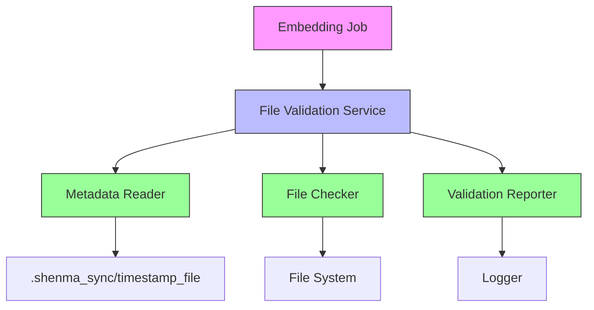
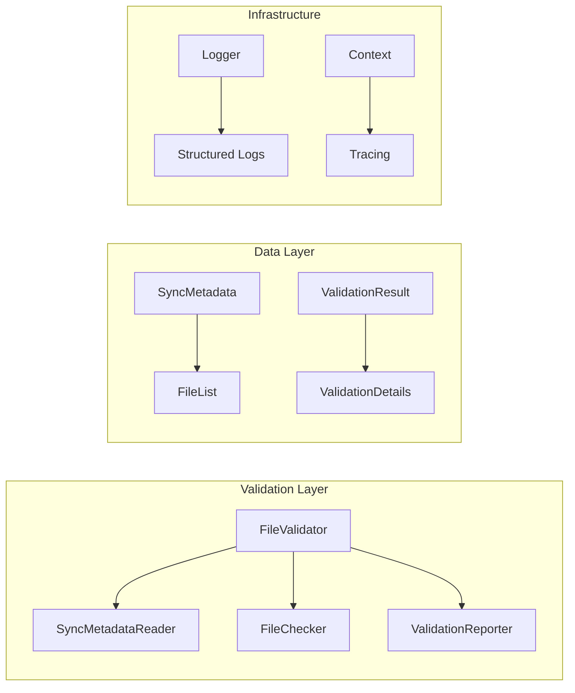
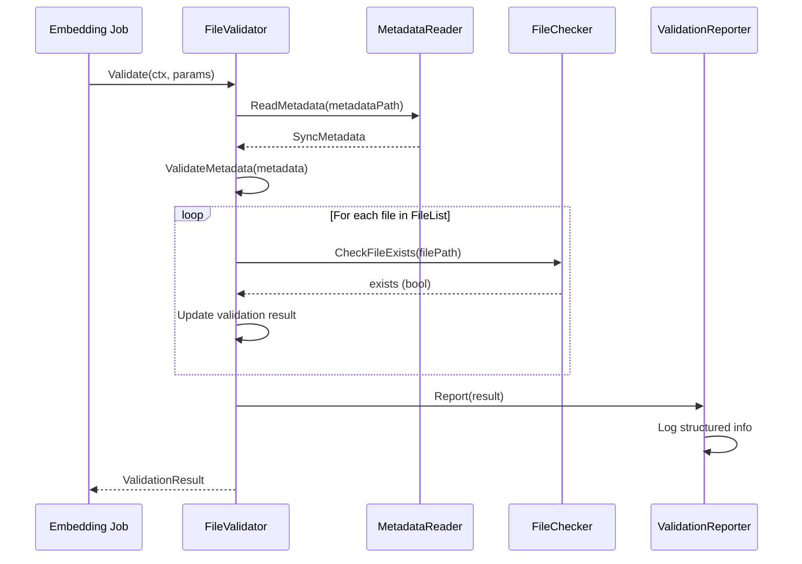
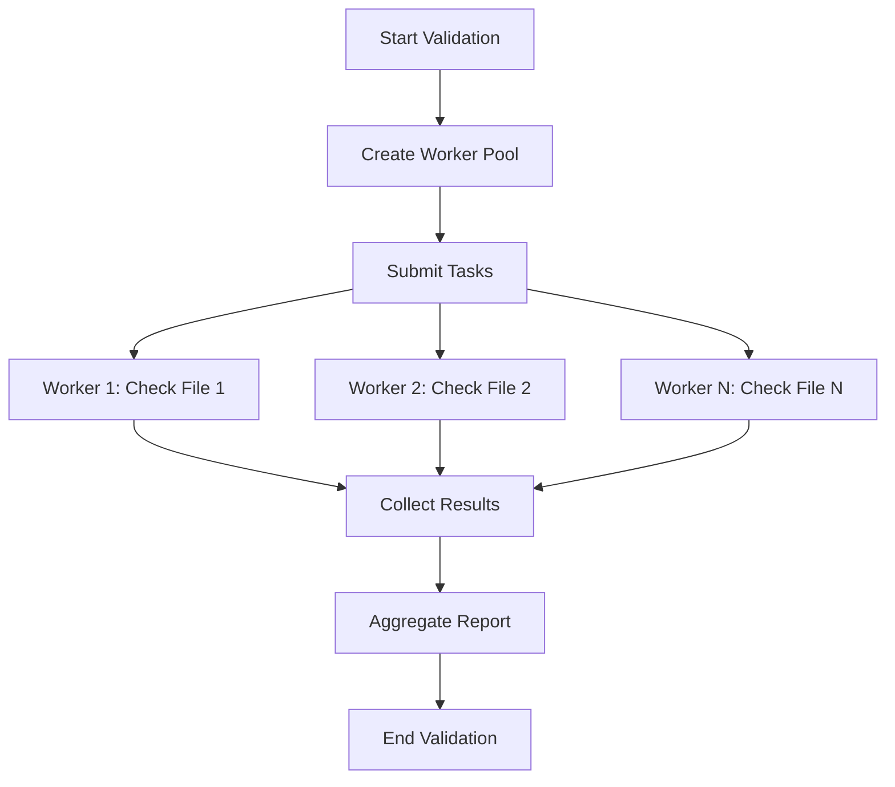

# 技术设计方案：提交嵌入任务 - 检查文件流程

## 1. 设计概述

### 1.1 设计目标
基于产品需求文档，实现"提交嵌入任务"处理流程中的"检查文件"环节，确保同步元数据中标记的文件与实际解压后的文件保持一致性验证。

### 1.2 设计范围
- 验证同步元数据中标记为"add"和"modify"的文件
- 实现文件存在性检查
- 生成完整的验证报告
- 提供结构化日志记录

## 2. 技术架构

### 2.1 整体架构图



### 2.2 组件架构



## 3. 技术方案

### 3.1 技术栈选择

| 组件 | 技术 | 版本 | 选择理由 |
|------|------|------|----------|
| 语言 | Go | 1.21+ | 高性能、并发支持、静态类型 |
| 并发库 | ants/v2 | v2.7.4 | 高性能协程池，资源控制 |
| 日志 | zap | 内置 | 结构化日志，性能优秀 |
| 路径处理 | filepath | 标准库 | 跨平台路径处理 |
| JSON处理 | encoding/json | 标准库 | 无需额外依赖 |

### 3.2 核心算法设计

#### 3.2.1 文件验证流程



#### 3.2.2 并发验证策略



## 4. 接口设计

### 4.1 核心接口定义

#### 4.1.1 FileValidator接口
```go
type FileValidator interface {
    Validate(ctx context.Context, params *types.ValidationParams) (*types.ValidationResult, error)
    SetConfig(config *types.ValidationConfig)
}
```

#### 4.1.2 数据结构定义

**ValidationParams**
```go
type ValidationParams struct {
    MetadataPath string            // 元数据文件路径
    ExtractPath  string            // 解压文件路径
    SkipPatterns []string          // 跳过文件模式
    Config       *ValidationConfig // 验证配置
}
```

**ValidationResult**
```go
type ValidationResult struct {
    TotalFiles      int                // 总验证文件数
    MatchedFiles    int                // 成功匹配数
    MismatchedFiles int                // 匹配失败数
    SkippedFiles    int                // 跳过文件数
    Details         []ValidationDetail // 详细验证结果
    Status          ValidationStatus   // 验证状态
    Timestamp       time.Time          // 验证时间戳
}
```

### 4.2 配置设计

**ValidationConfig**
```go
type ValidationConfig struct {
    CheckContent   bool     // 是否检查文件内容 (MVP: false)
    FailOnMismatch bool     // 不匹配时是否失败 (MVP: false)
    LogLevel       string   // 日志级别 (INFO/DEBUG)
    MaxConcurrency int      // 最大并发数 (默认: 10)
    Enabled        bool     // 是否启用文件验证
    SkipPatterns   []string // 跳过文件模式
}
```

## 5. 详细设计

### 5.1 文件验证逻辑

#### 5.1.1 验证规则
1. **文件存在性检查**: 验证元数据中指定的文件路径是否存在于解压目录
2. **状态匹配**: 验证文件状态是否为"add"或"modify"
3. **路径安全**: 防止路径遍历攻击
4. **跳过模式**: 支持基于模式的文件跳过

#### 5.1.2 错误处理策略
- 元数据格式错误: 记录错误，返回验证失败
- 文件系统访问错误: 记录具体错误，标记为缺失
- 并发错误: 聚合所有错误，统一返回

### 5.2 日志设计

#### 5.2.1 结构化日志格式
```json
{
  "timestamp": "2024-08-01T15:53:44+08:00",
  "level": "INFO",
  "component": "file_validator",
  "client_id": "client-123",
  "codebase_path": "/path/to/codebase",
  "validation_summary": {
    "total_files": 100,
    "matched_files": 95,
    "mismatched_files": 3,
    "skipped_files": 2,
    "status": "partial"
  },
  "failed_files": [
    {
      "path": "src/missing_file.py",
      "status": "missing",
      "expected": "add"
    }
  ]
}
```

#### 5.2.2 日志级别控制
- **INFO**: 验证摘要信息
- **DEBUG**: 详细验证过程
- **ERROR**: 验证失败详情
- **WARN**: 潜在问题警告

### 5.3 性能优化

#### 5.3.1 并发控制
- 使用协程池限制并发数
- 默认最大并发数: 10
- 可配置并发数

#### 5.3.2 内存优化
- 使用对象池复用临时对象
- 流式处理大文件列表
- 及时释放大内存块

## 6. 安全设计

### 6.1 路径安全
- **路径遍历防护**: 检查并清理所有文件路径
- **路径验证**: 确保所有路径都在解压目录范围内
- **符号链接处理**: 解析符号链接到实际路径

### 6.2 输入验证
- **元数据验证**: 验证JSON格式和必要字段
- **文件状态验证**: 只允许"add"和"modify"状态
- **路径格式验证**: 验证路径格式合法性

## 7. 测试策略

### 7.1 单元测试
- **元数据读取测试**: 测试各种格式的元数据解析
- **文件检查测试**: 测试文件存在性检查逻辑
- **并发验证测试**: 测试并发场景下的正确性
- **错误处理测试**: 测试各种错误场景的处理

### 7.2 集成测试
- **端到端验证测试**: 完整验证流程测试
- **性能测试**: 验证并发性能指标
- **边界测试**: 测试空文件列表、大文件列表等边界情况

### 7.3 测试用例设计

| 测试场景 | 预期结果 |
|----------|----------|
| 所有文件存在 | 验证成功 |
| 部分文件缺失 | 验证部分成功，记录缺失文件 |
| 元数据格式错误 | 返回错误 |
| 空文件列表 | 验证跳过 |
| 并发验证 | 结果正确，无竞态条件 |

## 8. 部署配置

### 8.1 环境配置

#### 8.1.1 开发环境
```yaml
validation:
  enabled: true
  log_level: debug
  max_concurrency: 5
  skip_patterns:
    - "*.tmp"
    - "*.log"
```

#### 8.1.2 生产环境
```yaml
validation:
  enabled: true
  log_level: info
  max_concurrency: 20
  skip_patterns:
    - "*.tmp"
    - "*.log"
    - ".git/*"
```

### 8.2 监控指标

| 指标名称 | 类型 | 描述 |
|----------|------|------|
| validation_duration | Histogram | 验证耗时 |
| validation_total | Counter | 总验证次数 |
| validation_success | Counter | 成功验证次数 |
| validation_failed | Counter | 失败验证次数 |
| files_processed | Gauge | 处理的文件数 |

## 9. 风险评估与缓解

### 9.1 技术风险

| 风险描述 | 概率 | 影响 | 缓解措施 |
|----------|------|------|----------|
| 大文件列表内存溢出 | 中 | 高 | 使用流式处理，分批验证 |
| 并发竞争条件 | 低 | 中 | 使用互斥锁保护共享数据 |
| 路径遍历攻击 | 低 | 高 | 严格路径验证和清理 |
| 文件系统权限问题 | 中 | 中 | 详细的错误处理和日志记录 |

### 9.2 性能风险
- **并发数过高**: 可能导致系统资源耗尽
- **大文件验证**: 可能影响整体性能
- **网络存储延迟**: 可能影响验证速度

## 10. 后续计划

### 10.1 MVP版本功能
- [x] 文件存在性验证
- [x] 并发验证支持
- [x] 结构化日志记录
- [x] 错误处理和报告

### 10.2 后续版本功能
- [ ] 文件内容哈希验证
- [ ] 增量验证支持
- [ ] 验证结果持久化
- [ ] Webhook通知机制
- [ ] 验证规则可配置化

### 10.3 技术债务
- [ ] 优化大文件列表处理
- [ ] 增加缓存机制
- [ ] 完善错误分类
- [ ] 增加性能监控

## 11. 附录

### 11.1 相关文档
- [产品需求文档](docs/product_requirement_docs.md)
- [功能文档](docs/function_document.md)
- [API文档](docs/api_documentation.md)

### 11.2 术语表
- **SyncMetadata**: 同步元数据，包含文件列表和状态
- **Validation**: 验证过程，检查文件存在性和状态匹配
- **FileList**: 元数据中的文件列表，包含文件路径和操作状态
- **MVP**: 最小可行产品版本