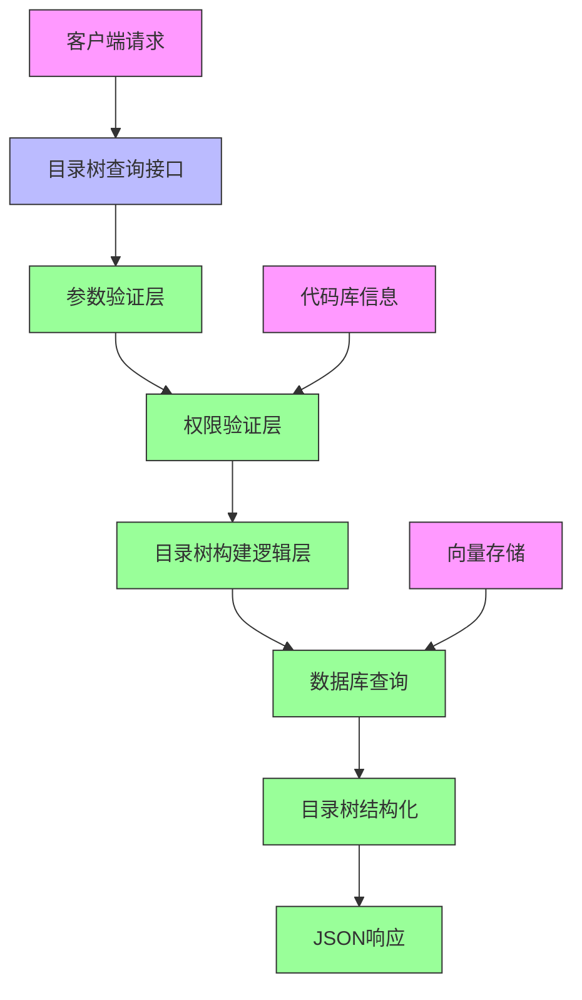
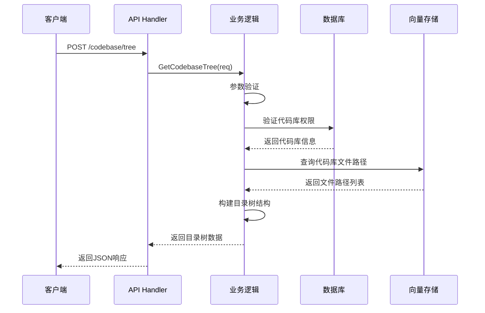

# 技术设计方案：代码库目录树查询接口

## 1. 设计概述

### 1.1 设计目标
基于产品需求文档和现有架构，设计并实现代码库目录树查询接口，提供层次化的目录结构展示功能，支持目录深度控制和文件节点过滤，为用户提供直观的代码库结构浏览体验。

### 1.2 设计范围
- 新增目录树查询接口：`POST /codebase-embedder/api/v1/codebase/tree`
- 实现目录树构建逻辑，支持层次化结构展示
- 支持maxDepth参数控制目录树深度
- 支持includeFiles参数控制是否包含文件节点
- 集成到现有架构中，保持代码风格一致性

## 2. 技术架构

### 2.1 整体架构图



### 2.2 数据流图



## 3. 技术方案

### 3.1 技术栈选择

| 组件 | 技术 | 版本 | 选择理由 |
|------|------|------|----------|
| 语言 | Go | 1.21+ | 与现有系统保持一致，高性能并发处理 |
| Web框架 | go-zero | - | 现有系统已采用，保持架构一致性 |
| 数据库 | PostgreSQL | - | 现有系统已采用，存储代码库元数据 |
| 向量存储 | Weaviate | - | 现有系统已采用，存储文件路径信息 |
| JSON处理 | encoding/json | 标准库 | 无需额外依赖，性能良好 |
| 日志 | zap | 内置 | 结构化日志，与现有系统集成 |

### 3.2 核心设计

#### 3.2.1 数据结构设计

**目录树节点结构**
```go
// TreeNode 目录树节点
type TreeNode struct {
    Name         string     `json:"name"`         // 节点名称
    Path         string     `json:"path"`         // 完整路径
    Type         string     `json:"type"`         // 节点类型: file/directory
    Size         int64      `json:"size,omitempty"` // 文件大小(字节)，仅文件节点有效
    LastModified *time.Time `json:"lastModified,omitempty"` // 最后修改时间，仅文件节点有效
    Children     []TreeNode `json:"children,omitempty"` // 子节点，仅目录节点有效
}
```

**目录树查询请求**
```go
// CodebaseTreeRequest 目录树查询请求
type CodebaseTreeRequest struct {
    ClientId     string  `json:"clientId"`     // 客户端唯一标识
    CodebasePath string  `json:"codebasePath"` // 项目绝对路径
    CodebaseName string  `json:"codebaseName"` // 项目名称
    MaxDepth     *int    `json:"maxDepth"`     // 目录树最大深度，可选
    IncludeFiles *bool   `json:"includeFiles"` // 是否包含文件节点，可选
}
```

**目录树查询响应**
```go
// CodebaseTreeResponse 目录树查询响应
type CodebaseTreeResponse struct {
    Code    int      `json:"code"`    // 响应码
    Message string   `json:"message"` // 响应消息
    Success bool     `json:"success"` // 是否成功
    Data    *TreeNode `json:"data"`   // 目录树数据
}
```

#### 3.2.2 目录树构建算法

```go
// BuildDirectoryTree 构建目录树
func BuildDirectoryTree(filePaths []string, maxDepth int, includeFiles bool) (*TreeNode, error) {
    root := &TreeNode{
        Name:     filepath.Base(filePaths[0]), // 假设第一个路径是根路径
        Path:     extractRootPath(filePaths),
        Type:     "directory",
        Children: []TreeNode{},
    }
    
    pathMap := make(map[string]*TreeNode)
    pathMap[root.Path] = root
    
    for _, filePath := range filePaths {
        if !includeFiles && !isDirectory(filePath) {
            continue
        }
        
        currentDepth := strings.Count(filePath, string(filepath.Separator))
        if maxDepth > 0 && currentDepth > maxDepth {
            continue
        }
        
        // 构建路径节点
        dir := filepath.Dir(filePath)
        parentPath := dir
        
        for parentPath != root.Path && parentPath != "." {
            if _, exists := pathMap[parentPath]; !exists {
                node := &TreeNode{
                    Name:     filepath.Base(parentPath),
                    Path:     parentPath,
                    Type:     "directory",
                    Children: []TreeNode{},
                }
                pathMap[parentPath] = node
                
                // 添加到父节点
                if parent, exists := pathMap[filepath.Dir(parentPath)]; exists {
                    parent.Children = append(parent.Children, *node)
                }
            }
            parentPath = filepath.Dir(parentPath)
        }
        
        // 添加文件节点
        if includeFiles && !isDirectory(filePath) {
            fileNode, err := createFileNode(filePath)
            if err != nil {
                continue
            }
            
            // 添加到父目录
            if parent, exists := pathMap[dir]; exists {
                parent.Children = append(parent.Children, *fileNode)
            } else {
                // 如果父目录不存在，创建并添加到根目录
                parentDir := &TreeNode{
                    Name:     filepath.Base(dir),
                    Path:     dir,
                    Type:     "directory",
                    Children: []TreeNode{*fileNode},
                }
                pathMap[dir] = parentDir
                root.Children = append(root.Children, *parentDir)
            }
        }
    }
    
    return root, nil
}
```

## 4. 详细设计

### 4.1 接口设计

#### 4.1.1 API接口定义
```
POST /codebase-embedder/api/v1/codebase/tree
Content-Type: application/json
```

**请求体示例**:
```json
{
  "clientId": "user_machine_id",
  "codebasePath": "/absolute/path/to/project",
  "codebaseName": "project_name",
  "maxDepth": 3,
  "includeFiles": true
}
```

**成功响应示例**:
```json
{
  "code": 0,
  "message": "ok",
  "success": true,
  "data": {
    "name": "project_name",
    "path": "/absolute/path/to/project",
    "type": "directory",
    "children": [
      {
        "name": "src",
        "path": "/absolute/path/to/project/src",
        "type": "directory",
        "children": [
          {
            "name": "main.js",
            "path": "/absolute/path/to/project/src/main.js",
            "type": "file",
            "size": 2048,
            "lastModified": "2025-07-28T12:00:00Z"
          }
        ]
      },
      {
        "name": "package.json",
        "path": "/absolute/path/to/project/package.json",
        "type": "file",
        "size": 512,
        "lastModified": "2025-07-28T10:15:00Z"
      }
    ]
  }
}
```

**错误响应示例**:
```json
{
  "code": 400,
  "message": "缺少必需参数: clientId",
  "success": false
}
```

### 4.2 模块划分

#### 4.2.1 Handler层
- **文件位置**: `internal/handler/codebase_tree.go`
- **职责**: 处理HTTP请求，参数验证，调用业务逻辑层
- **主要函数**: `TreeHandler`

#### 4.2.2 Logic层
- **文件位置**: `internal/logic/codebase_tree.go`
- **职责**: 实现目录树构建业务逻辑，权限验证，调用数据访问层
- **主要函数**: `GetCodebaseTree`

#### 4.2.3 Types层
- **文件位置**: `internal/types/codebase_tree.go`
- **职责**: 定义请求和响应数据结构
- **主要结构**: `CodebaseTreeRequest`, `CodebaseTreeResponse`, `TreeNode`

#### 4.2.4 Store层扩展
- **文件位置**: `internal/store/vector/codebase_tree.go`
- **职责**: 实现从向量存储中查询文件路径信息
- **主要函数**: `QueryFilePaths`

### 4.3 核心算法设计

#### 4.3.1 目录树构建流程
1. 从向量存储中获取代码库所有文件路径
2. 根据includeFiles参数过滤文件节点
3. 根据maxDepth参数限制目录深度
4. 构建层次化目录结构
5. 为文件节点添加元数据信息
6. 返回结构化的目录树

#### 4.3.2 路径处理算法
```go
// extractRootPath 提取根路径
func extractRootPath(filePaths []string) string {
    if len(filePaths) == 0 {
        return ""
    }
    
    // 找到所有路径的公共前缀
    commonPrefix := filePaths[0]
    for _, path := range filePaths[1:] {
        commonPrefix = findCommonPrefix(commonPrefix, path)
        if commonPrefix == "" {
            break
        }
    }
    
    return commonPrefix
}

// findCommonPrefix 找到两个路径的公共前缀
func findCommonPrefix(path1, path2 string) string {
    parts1 := strings.Split(path1, string(filepath.Separator))
    parts2 := strings.Split(path2, string(filepath.Separator))
    
    var commonParts []string
    for i := 0; i < len(parts1) && i < len(parts2); i++ {
        if parts1[i] == parts2[i] {
            commonParts = append(commonParts, parts1[i])
        } else {
            break
        }
    }
    
    return strings.Join(commonParts, string(filepath.Separator))
}
```

## 5. 数据库设计

### 5.1 现有表结构利用
- **codebase表**: 存储代码库基本信息，用于权限验证
- **向量存储**: 存储文件路径信息，用于构建目录树

### 5.2 查询优化
- 使用向量存储的批量查询接口提高性能
- 实现分页查询机制，支持大型代码库
- 添加缓存机制，减少重复查询

## 6. 性能设计

### 6.1 性能指标
- 小型代码库（<1000文件）：响应时间 < 500ms
- 中型代码库（10000文件）：响应时间 < 2s
- 大型代码库（>10000文件）：响应时间 < 5s
- 内存使用与代码库大小成线性关系

### 6.2 优化策略
- **并发处理**: 使用goroutine并行处理文件路径
- **内存优化**: 使用指针和切片优化内存使用
- **算法优化**: 使用哈希表快速查找和构建目录结构
- **缓存策略**: 对频繁访问的代码库目录树进行缓存

### 6.3 大型代码库处理
```go
// 分页查询文件路径
func (s *CodebaseTreeStore) QueryFilePathsWithPagination(ctx context.Context, codebaseId int32, pageSize int, callback func([]string) error) error {
    offset := 0
    for {
        filePaths, err := s.QueryFilePaths(ctx, codebaseId, pageSize, offset)
        if err != nil {
            return err
        }
        
        if len(filePaths) == 0 {
            break
        }
        
        if err := callback(filePaths); err != nil {
            return err
        }
        
        offset += len(filePaths)
    }
    return nil
}
```

## 7. 安全设计

### 7.1 输入验证
- **参数验证**: 验证所有必需参数是否存在
- **路径安全**: 防止路径遍历攻击
- **长度限制**: 限制字符串长度防止溢出攻击
- **类型验证**: 验证参数类型正确性

### 7.2 权限控制
- **客户端验证**: 基于clientId验证访问权限
- **代码库验证**: 验证请求的代码库是否存在且已完成索引
- **状态检查**: 确保代码库状态为"completed"

### 7.3 数据保护
- **敏感信息**: 不记录敏感信息到日志
- **错误处理**: 提供友好的错误信息，不暴露系统细节

## 8. 测试策略

### 8.1 单元测试
- **参数验证测试**: 测试各种参数组合
- **目录树构建测试**: 测试不同结构的目录树构建
- **边界条件测试**: 测试空路径、深层路径等边界情况
- **性能测试**: 测试不同规模代码库的处理性能

### 8.2 集成测试
- **API端到端测试**: 完整的API调用流程
- **权限验证测试**: 测试各种权限场景
- **数据一致性测试**: 确保返回数据与实际文件系统一致

### 8.3 测试用例

| 测试场景 | 输入 | 预期输出 |
|----------|------|----------|
| 正常查询 | 有效请求 | 完整目录树结构 |
| 深度限制 | maxDepth=2 | 限制深度的目录树 |
| 不包含文件 | includeFiles=false | 仅目录结构 |
| 权限不足 | 无效clientId | 403错误 |
| 代码库不存在 | 无效codebaseName | 404错误 |

## 9. 错误处理

### 9.1 错误类型
- **参数错误**: 缺少必填参数，返回400错误
- **权限错误**: 无权限访问，返回403错误
- **不存在错误**: 代码库不存在，返回404错误
- **状态错误**: 代码库未完成索引，返回409错误
- **系统错误**: 内部系统错误，返回500错误

### 9.2 错误处理策略
```go
// 错误处理示例
func (l *CodebaseTreeLogic) GetCodebaseTree(req *types.CodebaseTreeRequest) (*types.CodebaseTreeResponse, error) {
    // 参数验证
    if err := l.validateRequest(req); err != nil {
        l.Logger.Errorf("参数验证失败: %v", err)
        return nil, errs.NewParamError(err.Error())
    }
    
    // 权限验证
    codebaseInfo, err := l.verifyCodebasePermission(req)
    if err != nil {
        l.Logger.Errorf("权限验证失败: %v", err)
        return nil, errs.NewPermissionError(err.Error())
    }
    
    // 状态检查
    if codebaseInfo.Status != "completed" {
        return nil, errs.NewConflictError("代码库索引尚未完成，请稍后再试")
    }
    
    // 构建目录树
    tree, err := l.buildDirectoryTree(codebaseInfo, req)
    if err != nil {
        l.Logger.Errorf("构建目录树失败: %v", err)
        return nil, fmt.Errorf("构建目录树失败: %w", err)
    }
    
    return &types.CodebaseTreeResponse{
        Code:    0,
        Message: "ok",
        Success: true,
        Data:    tree,
    }, nil
}
```

## 10. 部署配置

### 10.1 配置项
```yaml
# 目录树查询配置
tree:
  max_depth: 10      # 默认最大深度
  page_size: 1000    # 分页查询大小
  cache_enabled: true # 是否启用缓存
  cache_ttl: 3600    # 缓存过期时间(秒)
```

### 10.2 监控指标
- **查询耗时**: 目录树查询响应时间
- **查询成功率**: 成功查询比例
- **错误率**: 各类错误发生频率
- **内存使用**: 目录树构建过程内存使用情况

## 11. 风险评估与缓解

### 11.1 技术风险

| 风险描述 | 概率 | 影响 | 缓解措施 |
|----------|------|------|----------|
| 性能风险 | 中 | 高 | 实现分页查询，限制返回数据量 |
| 内存溢出 | 低 | 高 | 使用流式处理，限制单次处理数据量 |
| 数据不一致 | 低 | 中 | 依赖已索引数据，添加数据校验 |
| 并发安全 | 低 | 中 | 使用无状态设计，避免共享状态 |

### 11.2 业务风险
- **用户体验**: 大型目录树可能影响前端渲染性能
  - 缓解措施: 提供maxDepth参数，实现懒加载机制
- **功能完整性**: 目录树可能无法反映最新文件系统状态
  - 缓解措施: 在响应中注明数据基于索引时的状态

## 12. 后续计划

### 12.1 MVP版本功能
- [x] 基础目录树查询接口实现
- [x] 参数验证和权限控制
- [x] 目录树构建算法实现
- [x] 性能优化和错误处理

### 12.2 后续版本功能
- [ ] 支持按文件类型过滤
- [ ] 支持按最后修改时间排序
- [ ] 实现目录树缓存机制
- [ ] 支持虚拟滚动优化大型目录树渲染
- [ ] 添加目录搜索和快速定位功能

### 12.3 技术债务
- [ ] 性能监控和优化
- [ ] 单元测试覆盖率提升
- [ ] 文档完善
- [ ] 代码重构和优化

## 13. 附录

### 13.1 相关文档
- [产品需求文档](docs/product_requirement_docs.md)
- [功能文档](docs/function_document.md)
- [API文档](docs/api_documentation.md)

### 13.2 术语表
- **TreeNode**: 目录树节点，包含名称、路径、类型等信息
- **MaxDepth**: 目录树最大深度，用于限制返回的目录层级
- **IncludeFiles**: 是否包含文件节点，用于控制返回内容
- **向量存储**: 存储文件路径和元数据的存储系统