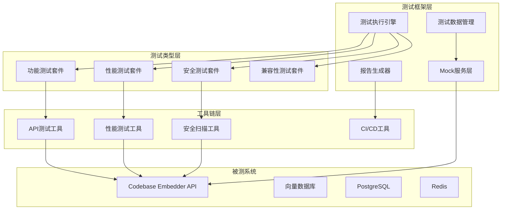
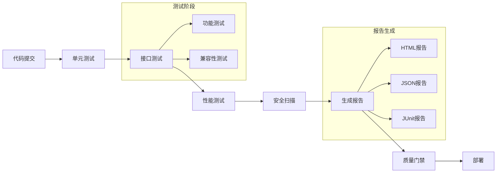

# 技术设计文档 - Codebase Embedder接口测试方案

## 1. 设计概述

### 1.1 设计目标
基于需求规格说明书，设计一套完整的接口测试技术方案，覆盖功能测试、性能测试、安全测试和兼容性测试四个维度，确保Codebase Embedder系统的4个核心RESTful接口质量达标。

### 1.2 设计范围
本技术设计涵盖测试框架架构、工具链选型、测试数据管理、CI/CD集成等关键技术方案，为后续测试实施提供技术指导。

## 2. 测试框架结构设计

### 2.1 整体架构图



### 2.2 目录结构设计

```
tests/
├── api/                          # API测试层
│   ├── functional/              # 功能测试
│   │   ├── semantic_search/     # 语义搜索接口
│   │   ├── index_summary/       # 索引摘要接口
│   │   ├── create_index/        # 创建索引接口
│   │   └── delete_index/        # 删除索引接口
│   ├── performance/             # 性能测试
│   │   ├── load_tests/          # 负载测试
│   │   ├── stress_tests/        # 压力测试
│   │   └── spike_tests/         # 峰值测试
│   ├── security/                # 安全测试
│   │   ├── input_validation/    # 输入验证
│   │   ├── authorization/       # 权限控制
│   │   └── data_protection/     # 数据保护
│   └── compatibility/           # 兼容性测试
│       ├── os_compatibility/    # 操作系统兼容
│       └── path_formats/        # 路径格式兼容
├── data/                        # 测试数据
│   ├── fixtures/               # 固定测试数据
│   ├── generators/             # 数据生成器
│   └── mocks/                  # Mock数据
├── utils/                      # 测试工具
│   ├── client/                 # API客户端
│   ├── assertions/             # 断言库
│   └── reporters/              # 报告生成
├── config/                     # 测试配置
│   ├── environments/           # 环境配置
│   └── test_data.yaml          # 测试数据配置
└── reports/                    # 测试报告
    ├── html/                   # HTML报告
    ├── json/                   # JSON报告
    └── junit/                  # JUnit格式报告
```

### 2.3 包划分策略

#### 2.3.1 按接口类型划分
- `semantic_search_test.go` - 语义搜索接口测试
- `index_summary_test.go` - 索引摘要接口测试
- `create_index_test.go` - 创建索引接口测试
- `delete_index_test.go` - 删除索引接口测试

#### 2.3.2 按测试类型划分
- `functional_test.go` - 功能测试套件
- `performance_test.go` - 性能测试套件
- `security_test.go` - 安全测试套件
- `compatibility_test.go` - 兼容性测试套件

## 3. 核心工具链选型

### 3.1 功能测试工具

| 工具类型 | 选型方案 | 版本要求 | 选择理由 |
|----------|----------|----------|----------|
| API测试框架 | Go-test + testify | 最新稳定版 | 与项目技术栈一致，原生支持并发测试 |
| HTTP客户端 | resty | v2.7.0+ | 功能丰富，支持重试、超时、认证等 |
| 断言库 | testify/assert | v1.8.0+ | 提供丰富的断言方法，错误信息清晰 |
| 测试数据管理 | gofakeit | v6.19.0+ | 生成真实感的测试数据 |

### 3.2 性能测试工具

| 工具类型 | 选型方案 | 版本要求 | 选择理由 |
|----------|----------|----------|----------|
| 负载测试 | k6 | v0.44.0+ | 现代化性能测试工具，支持JavaScript脚本 |
| 性能监控 | Prometheus + Grafana | 最新版 | 实时监控系统指标，可视化展示 |
| 资源监控 | docker stats | 内置 | 容器化环境下的资源监控 |

### 3.3 安全测试工具

| 工具类型 | 选型方案 | 版本要求 | 选择理由 |
|----------|----------|----------|----------|
| 安全扫描 | OWASP ZAP | v2.12.0+ | 开源安全扫描工具，支持自动化测试 |
| 静态分析 | gosec | v2.15.0+ | Go语言专用安全扫描工具 |
| 依赖检查 | nancy | v1.0.0+ | 检查Go依赖的安全漏洞 |

### 3.4 CI/CD集成工具

| 工具类型 | 选型方案 | 版本要求 | 选择理由 |
|----------|----------|----------|----------|
| CI平台 | GitHub Actions | 最新版 | 与代码仓库深度集成，免费额度充足 |
| 容器化 | Docker | 20.10+ | 保证测试环境一致性 |
| 编排工具 | Docker Compose | 3.8+ | 快速搭建测试环境 |

## 4. 测试数据管理方案

### 4.1 测试数据分类

#### 4.1.1 功能测试数据
```yaml
# test_data.yaml
functional:
  semantic_search:
    valid_queries:
      - "查找用户认证相关的函数"
      - "搜索数据库连接代码"
      - "获取API路由定义"
    invalid_queries:
      - ""  # 空查询
      - "x" * 1000  # 超长查询
      - "<script>alert('xss')</script>"  # XSS注入
    boundary_cases:
      - topK: 0, 1, 10, 100, 1000
      - codebasePath: "/invalid/path", "/very/long/path/..." , "C:\\Windows\\System32"
  
  index_management:
    valid_codebases:
      - small: 100个文件以内
      - medium: 1000-5000个文件
      - large: 10000+个文件
    invalid_paths:
      - "/root/protected"
      - "/etc/passwd"
      - "../../../etc/hosts"
```

#### 4.1.2 性能测试数据
```yaml
performance:
  load_levels:
    - light: 10 concurrent users
    - medium: 50 concurrent users
    - heavy: 100 concurrent users
    - extreme: 200 concurrent users
  
  test_datasets:
    - small_repo: 100 files, 1MB total
    - medium_repo: 5000 files, 100MB total
    - large_repo: 50000 files, 1GB total
```

### 4.2 Mock实现策略

#### 4.2.1 外部依赖Mock
```go
// 向量数据库Mock
type MockVectorStore struct {
    mock.Mock
}

func (m *MockVectorStore) Search(ctx context.Context, query string, topK int) ([]*types.SearchResult, error) {
    args := m.Called(ctx, query, topK)
    return args.Get(0).([]*types.SearchResult), args.Error(1)
}

// PostgreSQL Mock
type MockDB struct {
    mock.Mock
}

func (m *MockDB) GetIndexStatus(clientId, codebasePath string) (*types.IndexStatus, error) {
    args := m.Called(clientId, codebasePath)
    return args.Get(0).(*types.IndexStatus), args.Error(1)
}
```

#### 4.2.2 测试数据生成器
```go
// 代码库生成器
type CodebaseGenerator struct {
    basePath string
}

func (g *CodebaseGenerator) Generate(size string) error {
    switch size {
    case "small":
        return g.generateSmallRepo()
    case "medium":
        return g.generateMediumRepo()
    case "large":
        return g.generateLargeRepo()
    }
    return nil
}
```

### 4.3 数据清理策略
- **测试前清理**: 使用Docker容器隔离，每次测试重新创建环境
- **测试中清理**: 每个测试用例执行后清理产生的数据
- **测试后清理**: 使用defer机制确保资源释放

## 5. CI/CD流水线集成设计

### 5.1 流水线架构图



### 5.2 GitHub Actions工作流

```yaml
# .github/workflows/api-test.yml
name: API Testing Pipeline

on:
  push:
    branches: [ main, develop ]
  pull_request:
    branches: [ main ]

jobs:
  functional-test:
    runs-on: ubuntu-latest
    services:
      postgres:
        image: postgres:13
        env:
          POSTGRES_PASSWORD: testpass
        options: >-
          --health-cmd pg_isready
          --health-interval 10s
          --health-timeout 5s
          --health-retries 5
      
      redis:
        image: redis:6-alpine
        options: >-
          --health-cmd "redis-cli ping"
          --health-interval 10s
          --health-timeout 5s
          --health-retries 5
      
      weaviate:
        image: semitechnologies/weaviate:1.18.0
        env:
          QUERY_DEFAULTS_LIMIT: 25
          AUTHENTICATION_ANONYMOUS_ACCESS_ENABLED: 'true'
          PERSISTENCE_DATA_PATH: '/var/lib/weaviate'
          DEFAULT_VECTORIZER_MODULE: 'none'

    steps:
    - uses: actions/checkout@v3
    
    - name: Set up Go
      uses: actions/setup-go@v3
      with:
        go-version: 1.19
    
    - name: Install dependencies
      run: |
        go mod download
        go install github.com/securecodewarrior/gosec/v2/cmd/gosec@latest
    
    - name: Run functional tests
      run: |
        go test -v ./tests/api/functional/... -coverprofile=coverage.out
        go tool cover -html=coverage.out -o coverage.html
    
    - name: Run security scan
      run: gosec ./...
    
    - name: Upload coverage reports
      uses: codecov/codecov-action@v3
      with:
        file: ./coverage.out
```

### 5.3 性能测试集成

```yaml
# .github/workflows/performance-test.yml
name: Performance Testing

on:
  schedule:
    - cron: '0 2 * * *'  # 每天凌晨2点运行
  workflow_dispatch:

jobs:
  performance-test:
    runs-on: ubuntu-latest
    steps:
    - uses: actions/checkout@v3
    
    - name: Run k6 performance tests
      run: |
        docker run --rm \
          -v $PWD/tests/performance:/tests \
          loadimpact/k6 run /tests/load_test.js
    
    - name: Upload performance results
      uses: actions/upload-artifact@v3
      with:
        name: performance-results
        path: tests/reports/performance/
```

## 6. 测试执行策略

### 6.1 测试分层策略

| 测试层级 | 执行频率 | 触发条件 | 执行时间 |
|----------|----------|----------|----------|
| 单元测试 | 每次提交 | 代码变更 | < 2分钟 |
| 接口测试 | 每次提交 | 代码变更 | < 5分钟 |
| 性能测试 | 每日凌晨 | 定时任务 | < 30分钟 |
| 安全测试 | 每次发布 | 版本发布 | < 15分钟 |
| 兼容性测试 | 每周 | 定时任务 | < 60分钟 |

### 6.2 环境管理

#### 6.2.1 测试环境矩阵
```yaml
environments:
  dev:
    database: postgres://localhost:5432/testdb
    redis: redis://localhost:6379
    weaviate: http://localhost:8080
    
  staging:
    database: postgres://staging:5432/testdb
    redis: redis://staging:6379
    weaviate: http://staging:8080
    
  production:
    database: postgres://prod:5432/testdb
    redis: redis://prod:6379
    weaviate: http://prod:8080
```

#### 6.2.2 容器化测试环境
```dockerfile
# Dockerfile.test
FROM golang:1.19-alpine AS builder
WORKDIR /app
COPY go.mod go.sum ./
RUN go mod download
COPY . .
RUN go build -o api-test ./cmd/main.go

FROM alpine:latest
RUN apk --no-cache add ca-certificates
WORKDIR /root/
COPY --from=builder /app/api-test .
COPY --from=builder /app/tests ./tests
CMD ["./api-test"]
```

## 7. 质量门禁设计

### 7.1 代码覆盖率要求
- 单元测试覆盖率: ≥80%
- 接口测试覆盖率: ≥90%
- 整体测试覆盖率: ≥85%

### 7.2 性能指标要求
- 搜索接口P95响应时间: ≤2秒
- 索引接口吞吐量: ≥100文件/分钟
- 并发处理能力: ≥50并发用户

### 7.3 安全要求
- 高危漏洞: 0个
- 中危漏洞: ≤3个
- 低危漏洞: ≤10个

## 8. 监控与报告

### 8.1 测试监控指标

| 监控维度 | 关键指标 | 告警阈值 | 监控工具 |
|----------|----------|----------|----------|
| 测试成功率 | 测试用例通过率 | <95% | GitHub Actions |
| 测试执行时间 | 单次测试耗时 | >10分钟 | Prometheus |
| 资源使用 | CPU、内存使用率 | >80% | Grafana |
| 错误率 | 接口错误率 | >1% | ELK Stack |

### 8.2 报告生成策略

#### 8.2.1 测试报告格式
- **HTML报告**: 详细的可视化报告，包含图表和趋势分析
- **JSON报告**: 结构化数据，便于后续处理
- **JUnit报告**: 与CI/CD工具集成

#### 8.2.2 报告内容结构
```json
{
  "summary": {
    "total_tests": 100,
    "passed": 95,
    "failed": 3,
    "skipped": 2,
    "success_rate": 95.0
  },
  "details": {
    "functional": {...},
    "performance": {...},
    "security": {...},
    "compatibility": {...}
  },
  "trends": {
    "last_7_days": [...],
    "last_30_days": [...]
  }
}
```

## 9. 风险评估与缓解

### 9.1 技术风险

| 风险描述 | 概率 | 影响 | 缓解策略 |
|----------|------|------|----------|
| 测试环境不稳定 | 中 | 高 | 使用容器化技术，确保环境一致性 |
| 测试数据不足 | 低 | 中 | 建立测试数据生成器，覆盖各种场景 |
| 性能测试干扰生产 | 低 | 高 | 使用独立测试环境，避免影响生产 |
| 安全测试误报 | 中 | 中 | 建立白名单机制，减少误报 |

### 9.2 实施风险

| 风险描述 | 概率 | 影响 | 缓解策略 |
|----------|------|------|----------|
| 测试用例维护成本高 | 中 | 中 | 使用数据驱动测试，减少重复代码 |
| 测试执行时间过长 | 中 | 中 | 并行执行测试，优化测试策略 |
| 团队技能不足 | 低 | 中 | 提供培训和技术支持 |

## 10. 后续计划

### 10.1 短期计划（1-2周）
- [ ] 搭建基础测试框架
- [ ] 实现核心功能测试用例
- [ ] 配置CI/CD流水线
- [ ] 建立测试数据生成器

### 10.2 中期计划（3-4周）
- [ ] 完善性能测试场景
- [ ] 集成安全测试工具
- [ ] 建立测试报告系统
- [ ] 优化测试执行效率

### 10.3 长期计划（1-3个月）
- [ ] 建立测试度量体系
- [ ] 实现测试自动化运维
- [ ] 建立测试知识库
- [ ] 持续优化测试策略