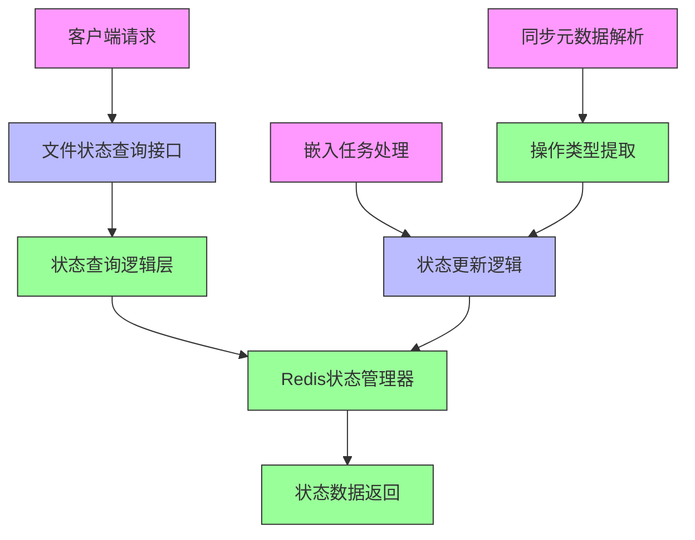
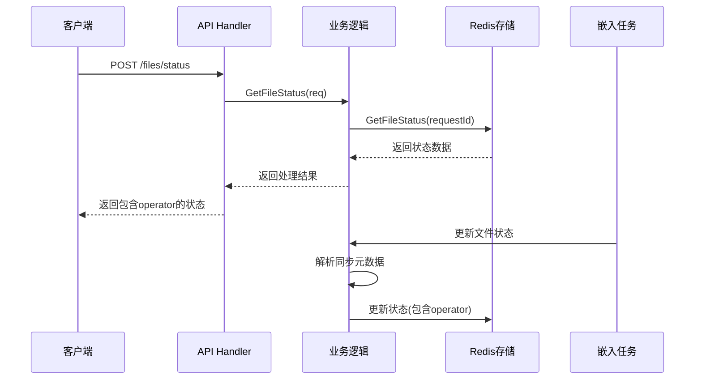

# 技术设计方案：文件状态查询功能 - Operator 返回增强

## 1. 设计概述

### 1.1 设计目标
基于产品需求文档和现有架构，为文件状态查询功能添加 operator 返回，增强功能以支持同步元数据中的文件操作类型（add/modify/delete）展示，提供更详细的文件处理状态信息。

### 1.2 设计范围
- 扩展现有 FileStatusItem 结构体，添加 operator 字段
- 修改文件状态查询逻辑，支持从同步元数据中提取操作类型
- 更新 Redis 状态管理，支持 operator 信息存储
- 保持向后兼容性，确保现有功能不受影响

## 2. 技术架构

### 2.1 整体架构图



### 2.2 数据流图



## 3. 技术方案

### 3.1 技术栈选择

| 组件 | 技术 | 版本 | 选择理由 |
|------|------|------|----------|
| 语言 | Go | 1.21+ | 与现有系统保持一致 |
| 状态存储 | Redis | 7.0+ | 高性能键值存储，支持复杂数据结构 |
| JSON处理 | encoding/json | 标准库 | 无需额外依赖，性能良好 |
| 日志 | zap | 内置 | 结构化日志，与现有系统集成 |

### 3.2 核心设计

#### 3.2.1 数据结构扩展

**FileStatusItem 结构体扩展**
```go
type FileStatusItem struct {
    Path    string `json:"path"`     // 文件路径
    Status  string `json:"status"`   // 文件状态（pending/processing/complete/failed）
    Operate string `json:"operate"`  // 操作类型（add/modify/delete）
}
```

**同步元数据结构**
```go
type SyncMetadata struct {
    ClientId     string            `json:"clientId"`
    CodebasePath string            `json:"codebasePath"`
    CodebaseName string            `json:"codebaseName"`
    ExtraMetadata json.RawMessage  `json:"extraMetadata"`
    FileList     map[string]string `json:"fileList"` // key: 文件路径, value: 操作类型
    Timestamp    int64             `json:"timestamp"`
}
```

#### 3.2.2 状态管理扩展

**Redis键结构设计**
```go
// 现有键结构保持不变
const (
    fileStatusPrefix = "file:status:"
    requestIdPrefix  = "request:id:"
    defaultExpiration = 24 * time.Hour
)
```

## 4. 详细设计

### 4.1 文件状态查询逻辑

#### 4.1.1 查询流程
1. 接收客户端请求，包含 clientId、codebasePath、codebaseName 和 syncId
2. 从 Redis 中获取对应的状态数据
3. 如果状态数据不存在，返回初始状态
4. 如果状态数据存在，直接返回包含 operator 信息的完整状态

#### 4.1.2 状态更新流程
1. 嵌入任务处理时解析同步元数据
2. 从元数据中提取文件操作类型（add/modify/delete）
3. 更新 Redis 中的状态数据，包含 operator 信息
4. 提供实时状态更新机制

### 4.2 同步元数据处理

#### 4.2.1 元数据解析逻辑
```go
// 解析同步元数据文件
func parseSyncMetadata(content []byte) (*SyncMetadata, error) {
    var metadata SyncMetadata
    if err := json.Unmarshal(content, &metadata); err != nil {
        return nil, fmt.Errorf("failed to parse sync metadata: %w", err)
    }
    return &metadata, nil
}

// 提取文件操作类型
func extractFileOperations(metadata *SyncMetadata) []FileStatusItem {
    var items []FileStatusItem
    for filePath, operation := range metadata.FileList {
        items = append(items, FileStatusItem{
            Path:    filePath,
            Status:  "pending",  // 初始状态
            Operate: operation,   // add/modify/delete
        })
    }
    return items
}
```

### 4.3 Redis状态管理

#### 4.3.1 状态存储格式
```json
{
  "process": "processing",
  "totalProgress": 50,
  "fileList": [
    {
      "path": "src/main/java/main.java",
      "status": "complete",
      "operate": "add"
    },
    {
      "path": "src/main/java/server.java",
      "status": "processing",
      "operate": "modify"
    },
    {
      "path": "src/main/java/old.java",
      "status": "complete",
      "operate": "delete"
    }
  ]
}
```

#### 4.3.2 状态更新策略
- **初始状态**: 文件状态为 "pending"，operator 从同步元数据中提取
- **处理中状态**: 文件状态更新为 "processing"，operator 保持不变
- **完成状态**: 文件状态更新为 "complete" 或 "failed"，operator 保持不变

## 5. 接口设计

### 5.1 API接口

#### 5.1.1 文件状态查询接口
**请求**: POST /codebase-embedder/api/v1/files/status
```json
{
  "clientId": "client-123",
  "codebasePath": "/path/to/codebase",
  "codebaseName": "project-name",
  "syncId": "request-id-123"
}
```

**响应**:
```json
{
  "code": 0,
  "message": "ok",
  "data": {
    "process": "processing",
    "totalProgress": 50,
    "fileList": [
      {
        "path": "src/main/java/main.java",
        "status": "complete",
        "operate": "add"
      },
      {
        "path": "src/main/java/server.java",
        "status": "processing",
        "operate": "modify"
      },
      {
        "path": "src/main/java/old.java",
        "status": "complete",
        "operate": "delete"
      }
    ]
  }
}
```

### 5.2 核心函数接口

#### 5.2.1 状态查询接口
```go
// GetFileStatus 获取文件处理状态（包含operator）
func (l *StatusLogic) GetFileStatus(req *types.FileStatusRequest) (*types.FileStatusResponseData, error)
```

#### 5.2.2 状态更新接口
```go
// UpdateFileStatusWithOperator 更新文件状态（包含operator）
func (sm *StatusManager) UpdateFileStatusWithOperator(ctx context.Context, requestId string, metadata *SyncMetadata) error
```

## 6. 数据库设计

### 6.1 Redis数据结构
- **键格式**: `request:id:{requestId}`
- **值类型**: JSON字符串
- **过期时间**: 24小时
- **数据结构**: FileStatusResponseData

### 6.2 数据一致性
- **写入一致性**: 使用Redis事务确保原子性
- **读取一致性**: 直接读取最新状态
- **过期策略**: 自动过期，避免内存泄漏

## 7. 错误处理

### 7.1 错误类型
- **参数错误**: 缺少必填参数，返回400错误
- **状态不存在**: 返回初始状态，不返回错误
- **Redis错误**: 记录日志，返回500错误
- **JSON解析错误**: 记录日志，返回500错误

### 7.2 错误处理策略
```go
// 错误处理示例
func (l *StatusLogic) GetFileStatus(req *types.FileStatusRequest) (*types.FileStatusResponseData, error) {
    // 参数验证
    if req.ClientId == "" || req.CodebasePath == "" || req.CodebaseName == "" {
        return nil, fmt.Errorf("missing required parameters")
    }
    
    // Redis查询
    status, err := l.svcCtx.StatusManager.GetFileStatus(l.ctx, req.SyncId)
    if err != nil {
        logx.Errorf("failed to get file status: %v", err)
        return nil, fmt.Errorf("internal server error")
    }
    
    // 返回状态或初始状态
    if status == nil {
        return l.getInitialStatus(req), nil
    }
    
    return status, nil
}
```

## 8. 性能优化

### 8.1 缓存策略
- **Redis缓存**: 利用Redis的高性能特性
- **内存缓存**: 可选的本地缓存减少Redis访问
- **缓存失效**: 基于时间的自动过期策略

### 8.2 并发控制
- **无状态设计**: 每个请求独立处理
- **Redis原子操作**: 确保并发安全
- **连接池**: 复用Redis连接

### 8.3 数据压缩
- **JSON压缩**: 可选的JSON压缩减少网络传输
- **字段优化**: 只包含必要字段

## 9. 安全设计

### 9.1 输入验证
- **参数验证**: 验证所有输入参数
- **路径安全**: 防止路径遍历攻击
- **长度限制**: 限制字符串长度

### 9.2 数据保护
- **敏感信息**: 不记录敏感信息到日志
- **访问控制**: 基于clientId的访问控制
- **数据加密**: 可选的Redis数据加密

## 10. 测试策略

### 10.1 单元测试
- **状态查询测试**: 测试各种查询场景
- **状态更新测试**: 测试状态更新逻辑
- **错误处理测试**: 测试错误场景
- **并发测试**: 测试并发安全性

### 10.2 集成测试
- **端到端测试**: 完整的API流程测试
- **性能测试**: 验证性能指标
- **兼容性测试**: 确保向后兼容

### 10.3 测试用例

| 测试场景 | 输入 | 预期输出 |
|----------|------|----------|
| 正常查询 | 有效请求 | 包含operator的状态数据 |
| 状态不存在 | 无效syncId | 初始状态 |
| 参数错误 | 缺少参数 | 400错误 |
| Redis错误 | 模拟Redis故障 | 500错误 |

## 11. 部署配置

### 11.1 环境配置
```yaml
# Redis配置
redis:
  host: "localhost"
  port: 6379
  password: ""
  db: 0

# 状态管理配置
status:
  expiration: "24h"
  max_connections: 100
```

### 11.2 监控指标
- **查询耗时**: 状态查询响应时间
- **Redis健康**: Redis连接状态
- **错误率**: API错误率统计
- **缓存命中率**: Redis缓存命中率

## 12. 风险评估与缓解

### 12.1 技术风险

| 风险描述 | 概率 | 影响 | 缓解措施 |
|----------|------|------|----------|
| Redis故障 | 中 | 高 |Redis集群部署，故障转移 |
| 数据不一致 | 低 | 中 | 使用Redis事务 |
| 性能瓶颈 | 中 | 中 | 连接池优化，缓存策略 |
| 向后兼容性 | 低 | 高 | 保持现有接口不变 |

### 12.2 业务风险
- **功能影响**: 新功能不影响现有功能
- **用户体验**: 提供更详细的文件状态信息
- **维护成本**: 代码结构清晰，易于维护

## 13. 后续计划

### 13.1 MVP版本功能
- [ ] 扩展FileStatusItem结构体，添加operator字段
- [ ] 修改状态查询逻辑，支持operator返回
- [ ] 更新嵌入任务处理，支持operator提取
- [ ] 完善测试用例和文档

### 13.2 后续版本功能
- [ ] 文件操作历史记录
- [ ] 批量状态查询优化
- [ ] 状态变更通知机制
- [ ] 更详细的错误信息

### 13.3 技术债务
- [ ] 性能监控和优化
- [ ] 错误处理机制完善
- [ ] 日志记录标准化
- [ ] 配置项管理优化

## 14. 附录

### 14.1 相关文档
- [产品需求文档](docs/product_requirement_docs.md)
- [功能文档](docs/function_document.md)
- [API文档](docs/api_documentation.md)

### 14.2 术语表
- **Operator**: 文件操作类型，包括add（新增）、modify（修改）、delete（删除）
- **SyncMetadata**: 同步元数据，包含文件列表和操作类型
- **FileStatus**: 文件状态，包含处理进度和操作类型
- **RequestId**: 请求唯一标识，用于查询状态