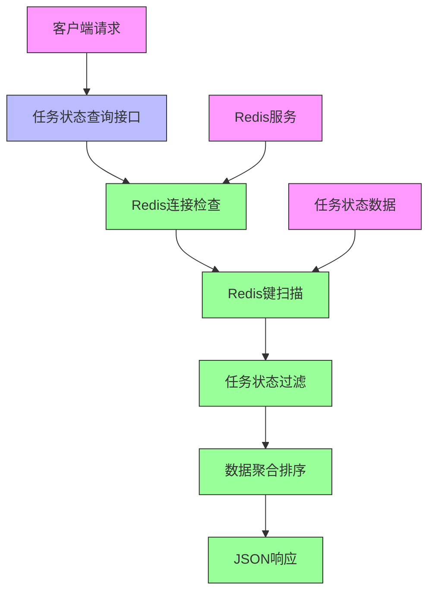
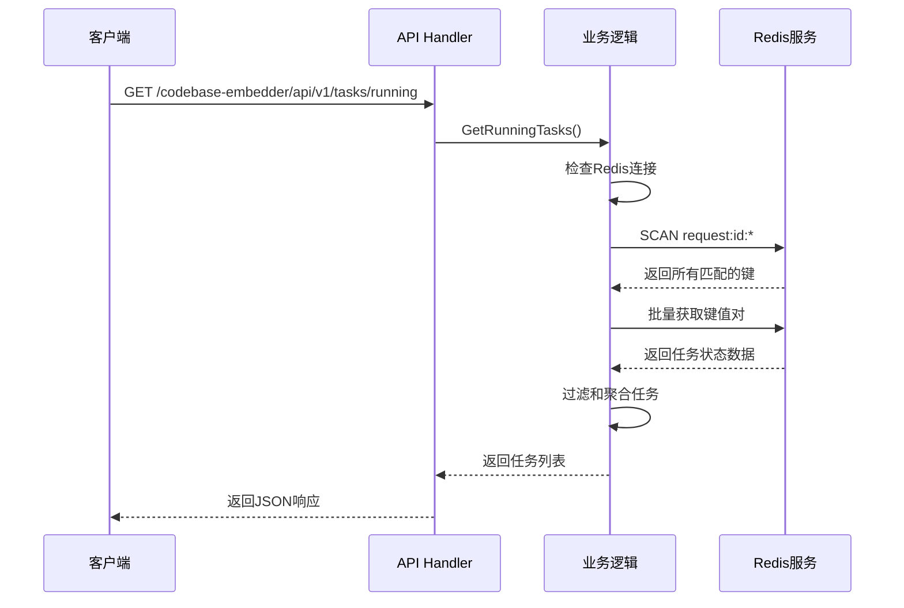

# 技术设计方案：正在执行任务状态查询GET接口

## 1. 设计概述

### 1.1 设计目标
基于产品需求文档和现有架构，设计并实现正在执行任务状态查询接口，提供从Redis中获取所有正在执行任务情况的功能，支持任务状态过滤、排序和聚合，为用户提供实时的任务执行状态监控能力。

### 1.2 设计范围
- 新增任务状态查询接口：`GET /codebase-embedder/api/v1/tasks/running`
- 实现Redis扫描逻辑，获取所有以"request:id:"为前缀的键
- 过滤出状态为pending、processing、running的任务
- 聚合任务信息并按照时间排序
- 集成到现有架构中，保持代码风格一致性

## 2. 技术架构

### 2.1 整体架构图



### 2.2 数据流图



## 3. 技术方案

### 3.1 技术栈选择

| 组件 | 技术 | 版本 | 选择理由 |
|------|------|------|----------|
| 语言 | Go | 1.21+ | 与现有系统保持一致，高性能并发处理 |
| Web框架 | go-zero | - | 现有系统已采用，保持架构一致性 |
| 缓存 | Redis | - | 现有系统已采用，存储任务状态数据 |
| JSON处理 | encoding/json | 标准库 | 无需额外依赖，性能良好 |
| 日志 | zap | 内置 | 结构化日志，与现有系统集成 |

### 3.2 核心设计

#### 3.2.1 数据结构设计

**运行中任务信息结构**
```go
// RunningTaskInfo 运行中任务信息
type RunningTaskInfo struct {
    TaskId                  string    `json:"taskId"`                  // 任务ID
    ClientId                string    `json:"clientId"`                // 客户端ID
    Status                  string    `json:"status"`                  // 任务状态
    Process                 string    `json:"process"`                 // 处理进程
    TotalProgress           int       `json:"totalProgress"`           // 总进度
    StartTime               time.Time `json:"startTime"`               // 开始时间
    LastUpdateTime          time.Time `json:"lastUpdateTime"`          // 最后更新时间
    EstimatedCompletionTime *time.Time `json:"estimatedCompletionTime,omitempty"` // 预计完成时间
    FileList                []FileStatusItem `json:"fileList"`         // 文件列表
}

// RunningTasksResponse 运行中任务查询响应
type RunningTasksResponse struct {
    Code      int               `json:"code"`      // 响应码
    Message   string            `json:"message"`   // 响应消息
    Success   bool              `json:"success"`   // 是否成功
    Data      *RunningTasksData `json:"data"`      // 任务数据
}

// RunningTasksData 运行中任务数据
type RunningTasksData struct {
    TotalTasks int                `json:"totalTasks"` // 任务总数
    Tasks      []RunningTaskInfo  `json:"tasks"`      // 任务列表
}
```

#### 3.2.2 Redis扫描算法

```go
// ScanRunningTasks 扫描运行中的任务
func (sm *StatusManager) ScanRunningTasks(ctx context.Context) ([]RunningTaskInfo, error) {
    var runningTasks []RunningTaskInfo
    
    // 使用SCAN命令避免阻塞
    iter := sm.client.Scan(ctx, 0, "request:id:*", 0).Iterator()
    for iter.Next(ctx) {
        key := iter.Val()
        
        // 获取任务状态数据
        data, err := sm.client.Get(ctx, key).Result()
        if err != nil {
            if err == redis.Nil {
                continue // 键可能已过期
            }
            return nil, fmt.Errorf("failed to get task data for key %s: %w", key, err)
        }
        
        // 解析任务状态
        var status FileStatusResponseData
        if err := json.Unmarshal([]byte(data), &status); err != nil {
            continue // 跳过格式错误的数据
        }
        
        // 过滤运行中的任务状态
        if isRunningStatus(status.Process) {
            taskInfo, err := sm.parseTaskInfo(key, status)
            if err != nil {
                continue
            }
            runningTasks = append(runningTasks, taskInfo)
        }
    }
    
    if err := iter.Err(); err != nil {
        return nil, fmt.Errorf("redis scan error: %w", err)
    }
    
    // 按开始时间排序
    sort.Slice(runningTasks, func(i, j int) bool {
        return runningTasks[i].StartTime.After(runningTasks[j].StartTime)
    })
    
    return runningTasks, nil
}

// isRunningStatus 检查是否为运行中的状态
func isRunningStatus(status string) bool {
    return status == "pending" || status == "processing" || status == "running"
}

// parseTaskInfo 解析任务信息
func (sm *StatusManager) parseTaskInfo(key string, status FileStatusResponseData) (RunningTaskInfo, error) {
    // 从key中提取任务ID
    taskId := strings.TrimPrefix(key, "request:id:")
    
    // 解析任务状态数据中的时间信息
    var startTime, lastUpdateTime time.Time
    var estimatedCompletionTime *time.Time
    
    // 这里需要根据实际的数据结构来解析时间信息
    // 如果FileStatusResponseData中不包含这些字段，可能需要扩展数据结构
    
    return RunningTaskInfo{
        TaskId:         taskId,
        ClientId:       "", // 需要从任务数据中提取或通过其他方式获取
        Status:         status.Process,
        Process:        status.Process,
        TotalProgress:  status.TotalProgress,
        StartTime:      startTime,
        LastUpdateTime: lastUpdateTime,
        EstimatedCompletionTime: estimatedCompletionTime,
        FileList:       status.FileList,
    }, nil
}
```

## 4. 详细设计

### 4.1 接口设计

#### 4.1.1 API接口定义
```
GET /codebase-embedder/api/v1/tasks/running
Content-Type: application/json
```

**成功响应示例**:
```json
{
  "code": 0,
  "message": "ok",
  "success": true,
  "data": {
    "totalTasks": 3,
    "tasks": [
      {
        "taskId": "request:id:uuid-generated-task-id-1",
        "clientId": "user_machine_id_1",
        "status": "running",
        "process": "embedding",
        "totalProgress": 65,
        "startTime": "2025-08-06T15:20:00Z",
        "lastUpdateTime": "2025-08-06T15:25:30Z",
        "estimatedCompletionTime": "2025-08-06T15:30:00Z",
        "fileList": [
          {
            "path": "src/main.js",
            "status": "complete",
            "operate": "add"
          },
          {
            "path": "src/utils/helper.js",
            "status": "processing",
            "operate": "modify"
          }
        ]
      },
      {
        "taskId": "request:id:uuid-generated-task-id-2",
        "clientId": "user_machine_id_2",
        "status": "pending",
        "process": "indexing",
        "totalProgress": 0,
        "startTime": "2025-08-06T15:25:00Z",
        "lastUpdateTime": "2025-08-06T15:25:00Z",
        "fileList": []
      },
      {
        "taskId": "request:id:uuid-generated-task-id-3",
        "clientId": "user_machine_id_1",
        "status": "processing",
        "process": "embedding",
        "totalProgress": 30,
        "startTime": "2025-08-06T15:15:00Z",
        "lastUpdateTime": "2025-08-06T15:22:00Z",
        "fileList": [
          {
            "path": "src/components/Header.jsx",
            "status": "complete",
            "operate": "add"
          },
          {
            "path": "src/components/Footer.jsx",
            "status": "pending",
            "operate": "add"
          }
        ]
      }
    ]
  }
}
```

**错误响应示例**:
```json
{
  "code": 503,
  "message": "Redis服务不可用，请稍后再试",
  "success": false
}
```

```json
{
  "code": 500,
  "message": "查询任务状态时发生内部错误",
  "success": false
}
```

### 4.2 模块划分

#### 4.2.1 Handler层
- **文件位置**: `internal/handler/running_tasks.go`
- **职责**: 处理HTTP请求，调用业务逻辑层
- **主要函数**: `RunningTasksHandler`

#### 4.2.2 Logic层
- **文件位置**: `internal/logic/running_tasks.go`
- **职责**: 实现任务状态查询业务逻辑，调用Redis服务
- **主要函数**: `GetRunningTasks`

#### 4.2.3 Types层扩展
- **文件位置**: `internal/types/running_tasks.go`
- **职责**: 定义请求和响应数据结构
- **主要结构**: `RunningTaskInfo`, `RunningTasksResponse`, `RunningTasksData`

#### 4.2.4 Redis层扩展
- **文件位置**: `internal/store/redis/running_tasks.go`
- **职责**: 实现Redis扫描和任务状态解析
- **主要函数**: `ScanRunningTasks`, `ParseTaskInfo`

### 4.3 核心算法设计

#### 4.3.1 Redis扫描流程
1. 检查Redis连接状态
2. 使用SCAN命令迭代获取所有以"request:id:"为前缀的键
3. 批量获取键值对数据
4. 解析JSON格式的任务状态数据
5. 过滤出状态为pending、processing、running的任务
6. 按开始时间排序任务列表
7. 返回结构化的任务数据

#### 4.3.2 任务状态解析算法
```go
// parseTaskStatus 解析任务状态
func parseTaskStatus(key string, jsonData string) (*RunningTaskInfo, error) {
    var fileStatus FileStatusResponseData
    if err := json.Unmarshal([]byte(jsonData), &fileStatus); err != nil {
        return nil, fmt.Errorf("failed to unmarshal task status: %w", err)
    }
    
    // 检查是否为运行中的状态
    if !isRunningStatus(fileStatus.Process) {
        return nil, nil // 跳过非运行状态的任务
    }
    
    // 提取任务ID
    taskId := strings.TrimPrefix(key, "request:id:")
    
    // 解析时间信息（这里需要根据实际数据结构调整）
    now := time.Now()
    taskInfo := &RunningTaskInfo{
        TaskId:         taskId,
        Status:         fileStatus.Process,
        Process:        fileStatus.Process,
        TotalProgress:  fileStatus.TotalProgress,
        StartTime:      now.Add(-time.Duration(fileStatus.TotalProgress) * time.Minute), // 估算开始时间
        LastUpdateTime: now,
        FileList:       fileStatus.FileList,
    }
    
    return taskInfo, nil
}
```

## 5. 数据存储设计

### 5.1 Redis数据结构
- **键格式**: `request:id:{uuid}`
- **值格式**: JSON字符串，包含FileStatusResponseData结构
- **过期策略**: 24小时自动过期
- **扫描策略**: 使用SCAN命令避免阻塞

### 5.2 数据查询优化
- 使用SCAN命令替代KEYS命令，避免阻塞Redis
- 实现批量获取机制，减少网络往返
- 添加超时控制，防止长时间阻塞

## 6. 性能设计

### 6.1 性能指标
- 少量任务（<10个）：响应时间 < 200ms
- 中等数量任务（10-50个）：响应时间 < 500ms
- 大量任务（>50个）：响应时间 < 2s
- Redis内存使用与任务数量成线性关系

### 6.2 优化策略
- **并发扫描**: 使用goroutine并发处理任务数据解析
- **内存优化**: 使用流式处理，避免一次性加载所有数据
- **缓存策略**: 对频繁访问的查询结果进行短期缓存
- **分页支持**: 为后续扩展预留分页查询能力

### 6.3 大量任务处理
```go
// scanWithPagination 分页扫描任务
func (sm *StatusManager) scanWithPagination(ctx context.Context, scanCount int64, callback func([]string) error) error {
    var cursor uint64
    for {
        keys, nextCursor, err := sm.client.Scan(ctx, cursor, "request:id:*", scanCount).Result()
        if err != nil {
            return fmt.Errorf("redis scan error: %w", err)
        }
        
        if len(keys) > 0 {
            if err := callback(keys); err != nil {
                return err
            }
        }
        
        if nextCursor == 0 {
            break
        }
        cursor = nextCursor
    }
    return nil
}
```

## 7. 安全设计

### 7.1 输入验证
- **参数验证**: 验证请求路径和参数格式
- **连接安全**: 确保Redis连接安全性
- **超时控制**: 防止长时间阻塞

### 7.2 权限控制
- **访问控制**: 确保接口有适当的访问权限
- **数据隔离**: 确保不同客户端的数据隔离

### 7.3 数据保护
- **敏感信息**: 不记录敏感信息到日志
- **错误处理**: 提供友好的错误信息，不暴露系统细节

## 8. 测试策略

### 8.1 单元测试
- **Redis连接测试**: 测试Redis连接状态检查
- **扫描功能测试**: 测试SCAN命令的正确性
- **数据解析测试**: 测试JSON数据解析功能
- **过滤逻辑测试**: 测试任务状态过滤逻辑

### 8.2 集成测试
- **API端到端测试**: 完整的API调用流程
- **Redis集成测试**: 测试与Redis服务的集成
- **错误场景测试**: 测试各种错误情况的处理

### 8.3 测试用例

| 测试场景 | 输入 | 预期输出 |
|----------|------|----------|
| 正常查询 | 无参数 | 返回所有运行中的任务 |
| Redis不可用 | Redis服务关闭 | 503错误 |
| 无运行中任务 | Redis中无运行任务 | 返回空任务列表 |
| 数据格式错误 | 包含错误JSON数据 | 跳过错误数据，返回有效数据 |

## 9. 错误处理

### 9.1 错误类型
- **Redis连接错误**: Redis服务不可用，返回503错误
- **数据解析错误**: JSON格式错误，跳过错误数据
- **超时错误**: 查询超时，返回504错误
- **系统错误**: 内部系统错误，返回500错误

### 9.2 错误处理策略
```go
// 错误处理示例
func (l *RunningTasksLogic) GetRunningTasks() (*types.RunningTasksResponse, error) {
    // 检查Redis连接
    if err := l.checkRedisConnection(); err != nil {
        l.Logger.Errorf("Redis连接检查失败: %v", err)
        return nil, errs.NewServiceUnavailableError("Redis服务不可用，请稍后再试")
    }
    
    // 扫描任务状态
    tasks, err := l.scanRunningTasks()
    if err != nil {
        l.Logger.Errorf("扫描任务状态失败: %v", err)
        return nil, fmt.Errorf("查询任务状态时发生内部错误: %w", err)
    }
    
    return &types.RunningTasksResponse{
        Code:    0,
        Message: "ok",
        Success: true,
        Data: &types.RunningTasksData{
            TotalTasks: len(tasks),
            Tasks:      tasks,
        },
    }, nil
}
```

## 10. 部署配置

### 10.1 配置项
```yaml
# 任务状态查询配置
running_tasks:
  redis_timeout: 5000     # Redis操作超时时间(毫秒)
  scan_batch_size: 100    # 单次扫描的键数量
  max_scan_time: 10000    # 最大扫描时间(毫秒)
  cache_enabled: false    # 是否启用缓存
  cache_ttl: 60          # 缓存过期时间(秒)
```

### 10.2 监控指标
- **查询耗时**: 任务状态查询响应时间
- **查询成功率**: 成功查询比例
- **扫描性能**: Redis扫描操作性能
- **错误率**: 各类错误发生频率
- **任务数量**: 系统中运行中的任务数量

## 11. 风险评估与缓解

### 11.1 技术风险

| 风险描述 | 概率 | 影响 | 缓解措施 |
|----------|------|------|----------|
| Redis性能风险 | 中 | 高 | 使用SCAN命令，实现超时控制 |
| 内存占用风险 | 中 | 中 | 实现流式处理，限制单次处理数据量 |
| 数据一致性风险 | 低 | 中 | 添加数据校验，跳过格式错误数据 |
| 并发安全风险 | 低 | 低 | 使用无状态设计，避免共享状态 |

### 11.2 业务风险
- **数据隐私风险**: 返回所有客户端的任务信息可能涉及数据隐私
  - 缓解措施: 实现适当的访问控制和权限验证
- **系统负载风险**: 频繁查询可能影响系统整体性能
  - 缓解措施: 实现查询频率限制，建议客户端使用合理的轮询间隔

## 12. 后续扩展计划

### 12.1 短期扩展
- 支持按客户端ID过滤任务
- 支持按任务状态过滤任务
- 支持按时间范围过滤任务
- 支持分页查询大量任务

### 12.2 长期扩展
- 支持任务状态变更通知（WebSocket）
- 支持任务执行时间统计
- 支持任务历史记录查询
- 支持任务性能分析和优化建议
- 支持任务管理功能（暂停、恢复、取消）

## 13. 实施计划

### 13.1 开发任务分解
1. **数据结构定义**: 定义RunningTaskInfo等数据结构
2. **Redis层实现**: 实现ScanRunningTasks等功能
3. **Logic层实现**: 实现GetRunningTasks业务逻辑
4. **Handler层实现**: 实现HTTP处理器
5. **路由配置**: 在routes.go中添加新路由
6. **单元测试**: 编写各层单元测试
7. **集成测试**: 进行端到端测试
8. **文档更新**: 更新API文档和技术文档

### 13.2 时间估算
- 数据结构定义: 0.5天
- Redis层实现: 1天
- Logic层实现: 0.5天
- Handler层实现: 0.5天
- 路由配置: 0.5天
- 单元测试: 1天
- 集成测试: 0.5天
- 文档更新: 0.5天
- **总计**: 5天

### 13.3 资源需求
- 开发人员: 1名Go开发工程师
- 测试环境: Redis服务、测试数据库
- 部署环境: 与现有系统一致的部署环境