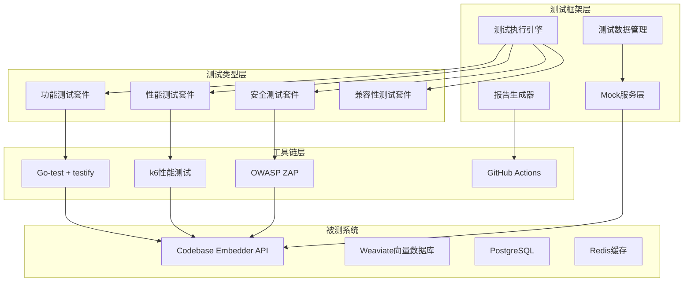
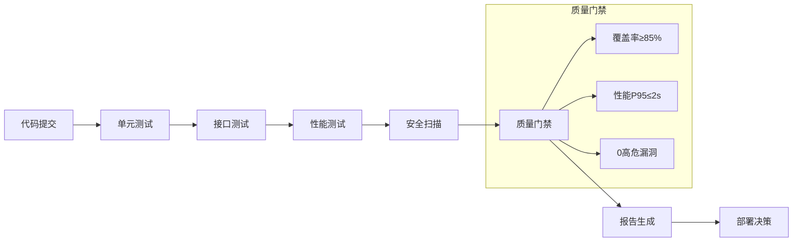

# Codebase Embedder 最终测试方案汇总文档
**文档版本**: v1.0  
**发布日期**: 2025-07-28  
**文档状态**: 正式发布  

---

## 版本控制页

| 版本号 | 发布日期 | 作者 | 变更描述 | 审核状态 |
|--------|----------|------|----------|----------|
| v1.0 | 2025-07-28 | 架构团队 | 初始版本，整合需求、技术、实施文档 | 已审核 |

---

## 目录

- [第1章：测试范围](#第1章测试范围)
- [第2章：技术架构](#第2章技术架构)
- [第3章：实施指南](#第3章实施指南)
- [附录A：接口清单](#附录a接口清单)
- [附录B：风险登记册](#附录b风险登记册)

---

## 第1章：测试范围

### 1.1 项目背景
Codebase Embedder是一个代码库嵌入和语义搜索系统，提供基于向量化技术的代码片段检索能力。系统通过RESTful API为开发者提供代码索引、语义搜索、索引管理等功能。

### 1.2 测试目标
- 确保所有RESTful接口的功能完整性和正确性
- 建立全面的接口测试体系，覆盖功能、性能、安全性和兼容性维度
- 制定可执行的验收标准，保证接口质量
- 识别并规避潜在的技术和业务风险

### 1.3 测试范围界定
本文档涵盖Codebase Embedder系统提供的4个核心RESTful接口的测试需求定义，包括接口端点说明、测试场景分类、验收标准和风险分析。

### 1.4 核心接口清单

| 接口名称 | HTTP方法 | 端点路径 | 核心功能 |
|----------|----------|----------|----------|
| 语义搜索 | GET | /codebase-embedder/api/v1/search/semantic | 基于自然语言查询的代码语义搜索 |
| 索引摘要 | GET | /codebase-embedder/api/v1/embeddings/summary | 获取代码库索引状态和统计信息 |
| 创建索引 | POST | /codebase-embedder/api/v1/embeddings | 触发代码库向量化索引任务 |
| 删除索引 | DELETE | /codebase-embedder/api/v1/embeddings | 删除指定代码库或文件的索引数据 |

### 1.5 测试场景分类

#### 1.5.1 功能测试场景
- **语义搜索功能测试**
  - FT-SS-001: 有效查询返回匹配代码片段
  - FT-SS-002: 无效参数返回清晰错误信息

- **索引管理功能测试**
  - FT-IM-001: 创建索引启动异步任务
  - FT-IM-002: 查询状态返回准确统计信息

#### 1.5.2 性能测试场景
- **搜索性能测试**
  - PT-SS-001: 高并发下95%请求响应时间≤2秒
  - PT-SS-002: 大型代码库搜索性能验证

- **索引性能测试**
  - PT-IM-001: 10万文件代码库索引时间≤4小时

#### 1.5.3 安全性测试场景
- **输入验证测试**
  - ST-IV-001: 恶意输入被拒绝并记录安全日志

- **权限控制测试**
  - ST-PC-001: 越权访问被拦截返回403错误

#### 1.5.4 兼容性测试场景
- **路径兼容性测试**
  - CT-PC-001: 支持Windows/Linux/macOS路径格式

- **编码兼容性测试**
  - CT-EC-001: 支持UTF-8/GBK/ASCII编码格式

### 1.6 验收标准矩阵

| 测试维度 | 验收标准 | 测量方法 | 通过阈值 |
|----------|----------|----------|----------|
| **功能验收** |
| 语义搜索准确性 | 返回结果相关性 | 人工评估Top10结果 | ≥80%相关 |
| 索引完整性 | 索引文件覆盖率 | 对比文件系统与索引记录 | 100%覆盖 |
| 数据一致性 | 索引状态准确性 | 实时状态与摘要信息对比 | 100%一致 |
| **性能验收** |
| 搜索响应时间 | ≤2秒 | 100并发用户P95响应时间 | 实测达标 |
| 索引吞吐量 | ≥100文件/分钟 | 标准代码库平均处理速度 | 实测达标 |
| 并发处理能力 | ≥50并发搜索 | 持续30分钟成功率 | ≥99% |
| **安全验收** |
| 输入验证 | 拒绝所有恶意输入 | SQL注入、路径遍历测试 | 0个安全漏洞 |
| 权限控制 | 防止越权访问 | 横向权限测试 | 100%拦截 |
| 数据保护 | 敏感信息不泄露 | 日志审计、响应检查 | 无敏感信息暴露 |

---

## 第2章：技术架构

### 2.1 整体测试架构



### 2.2 技术栈选型

| 技术类别 | 选型方案 | 版本要求 | 选择理由 |
|----------|----------|----------|----------|
| **测试框架** |
| API测试框架 | Go-test + testify | 最新稳定版 | 与项目技术栈一致，原生支持并发测试 |
| HTTP客户端 | resty | v2.7.0+ | 功能丰富，支持重试、超时、认证等 |
| 断言库 | testify/assert | v1.8.0+ | 提供丰富的断言方法，错误信息清晰 |
| **性能测试** |
| 负载测试 | k6 | v0.44.0+ | 现代化性能测试工具，支持JavaScript脚本 |
| 性能监控 | Prometheus + Grafana | 最新版 | 实时监控系统指标，可视化展示 |
| **安全测试** |
| 安全扫描 | OWASP ZAP | v2.12.0+ | 开源安全扫描工具，支持自动化测试 |
| 静态分析 | gosec | v2.15.0+ | Go语言专用安全扫描工具 |
| **CI/CD集成** |
| CI平台 | GitHub Actions | 最新版 | 与代码仓库深度集成，免费额度充足 |
| 容器化 | Docker | 20.10+ | 保证测试环境一致性 |

### 2.3 测试数据架构

#### 2.3.1 数据分类策略
```yaml
# 测试数据配置
functional:
  semantic_search:
    valid_queries:
      - "查找用户认证相关的函数"
      - "搜索数据库连接代码"
    invalid_queries:
      - ""  # 空查询
      - "x" * 1000  # 超长查询
    boundary_cases:
      - topK: [0, 1, 10, 100, 1000]

performance:
  load_levels:
    - light: 10 concurrent users
    - medium: 50 concurrent users
    - heavy: 100 concurrent users
```

#### 2.3.2 Mock实现架构
```go
// 核心Mock接口定义
type MockVectorStore interface {
    Search(ctx context.Context, query string, topK int) ([]*SearchResult, error)
}

type MockDB interface {
    GetIndexStatus(clientId, codebasePath string) (*IndexStatus, error)
}
```

### 2.4 CI/CD流水线架构



---

## 第3章：实施指南

### 3.1 环境准备

#### 3.1.1 系统要求
- **操作系统**: Windows 10/11, macOS, Linux
- **Go版本**: 1.19+
- **容器环境**: Docker 20.10+
- **数据库**: PostgreSQL 13+, Redis 6+, Weaviate 1.18+

#### 3.1.2 依赖安装
```bash
# 安装测试依赖
go get github.com/stretchr/testify
go get github.com/gorilla/mux

# 安装性能测试工具
go install go.k6.io/k6@latest

# 安装安全扫描工具
go install github.com/securecodewarrior/gosec/v2/cmd/gosec@latest
```

### 3.2 测试执行指南

#### 3.2.1 快速开始
```bash
# 1. 克隆项目
git clone <repository-url>
cd codebase-embedder

# 2. 启动测试环境
docker-compose -f deploy/docker-compose.yml up -d

# 3. 运行所有功能测试
go test ./test/api/functional/... -v

# 4. 查看覆盖率报告
go test ./test/api/functional/... -coverprofile=coverage.out
go tool cover -html=coverage.out -o coverage.html
```

#### 3.2.2 分阶段测试执行

| 测试阶段 | 执行命令 | 预期时间 | 关键指标 |
|----------|----------|----------|----------|
| **功能测试** |
| 全部功能测试 | `go test ./test/api/functional/... -v` | 2-5分钟 | 通过率≥95% |
| 单个接口测试 | `go test -run TestSemanticSearch -v` | 10-30秒 | 全部通过 |
| **性能测试** |
| 负载测试 | `k6 run test/performance/load_test.js` | 5-15分钟 | P95≤2秒 |
| 压力测试 | `k6 run test/performance/stress_test.js` | 10-30分钟 | 错误率<1% |
| **安全测试** |
| 静态扫描 | `gosec ./...` | 1-3分钟 | 0高危漏洞 |
| 动态扫描 | `zap-baseline.py -t <target>` | 5-10分钟 | 中危≤3个 |

### 3.3 测试数据管理

#### 3.3.1 测试代码库结构
```
test/data/
├── fixtures/
│   ├── small-repo/          # 100个文件以内
│   ├── medium-repo/         # 1000-5000个文件
│   └── large-repo/          # 10000+个文件
├── generators/
│   └── codebase_generator.go
└── mocks/
    ├── db_mock.go
    ├── redis_mock.go
    └── vector_store_mock.go
```

#### 3.3.2 数据清理策略
- **测试前清理**: Docker容器隔离，每次测试重新创建环境
- **测试中清理**: 每个测试用例执行后清理产生的数据
- **测试后清理**: 使用defer机制确保资源释放

### 3.4 调试与故障排除

#### 3.4.1 日志调试
```bash
# 启用详细日志
go test ./test/api/functional -v -args -log-level=debug

# 输出到文件
go test ./test/api/functional -v > test.log 2>&1
```

#### 3.4.2 断点调试
```bash
# 安装delve调试器
go install github.com/go-delve/delve/cmd/dlv@latest

# 调试单个测试
dlv test ./test/api/functional -- -test.run TestSemanticSearch_Success
```

#### 3.4.3 常见问题处理

| 问题类型 | 症状描述 | 解决方案 |
|----------|----------|----------|
| **测试失败** |
| Mock期望不匹配 | 测试断言失败 | 检查Mock期望设置和调用参数 |
| 依赖服务不可用 | 连接超时错误 | 确认Docker服务已启动 |
| **并发问题** |
| 测试数据冲突 | 间歇性失败 | 使用独立测试数据，避免共享状态 |
| 资源竞争 | 死锁或超时 | 调整并发度，使用`-parallel 1` |
| **性能问题** |
| 测试执行缓慢 | 单次测试>5分钟 | 优化测试数据规模，检查系统资源 |

### 3.5 持续集成配置

#### 3.5.1 GitHub Actions工作流
```yaml
# .github/workflows/api-test.yml
name: API Testing Pipeline
on: [push, pull_request]

jobs:
  test:
    runs-on: ubuntu-latest
    steps:
    - uses: actions/checkout@v3
    - uses: actions/setup-go@v3
      with:
        go-version: 1.19
    
    - name: Run tests
      run: |
        go test ./test/api/functional/... -v -coverprofile=coverage.out
        go tool cover -html=coverage.out -o coverage.html
    
    - name: Upload coverage
      uses: codecov/codecov-action@v3
```

#### 3.5.2 质量门禁
- **功能测试通过率**: ≥95%
- **代码覆盖率**: ≥85%
- **性能测试P95响应时间**: ≤2秒
- **安全扫描**: 0高危漏洞

---

## 附录A：接口清单

### A.1 语义搜索接口

| 属性 | 详情 |
|------|------|
| **端点** | GET /codebase-embedder/api/v1/search/semantic |
| **功能描述** | 基于自然语言查询的代码语义搜索 |
| **请求参数** | - clientId: 用户机器ID (必填, string)<br>- codebasePath: 项目绝对路径 (必填, string)<br>- query: 查询内容 (必填, string)<br>- topK: 结果返回数量 (选填, int, 默认10) |
| **响应格式** | ```json<br>{<br>  "code": 200,<br>  "data": [{<br>    "filePath": "string",<br>    "content": "string",<br>    "score": 0.95<br>  }],<br>  "message": "success"<br>}<br>``` |
| **错误码** | 400: 参数错误<br>404: 代码库未找到<br>500: 服务器内部错误 |

### A.2 索引摘要接口

| 属性 | 详情 |
|------|------|
| **端点** | GET /codebase-embedder/api/v1/embeddings/summary |
| **功能描述** | 获取代码库索引状态和统计信息 |
| **请求参数** | - clientId: 用户机器ID (必填, string)<br>- codebasePath: 项目绝对路径 (必填, string) |
| **响应格式** | ```json<br>{<br>  "code": 200,<br>  "data": {<br>    "totalFiles": 1000,<br>    "indexedChunks": 5000,<br>    "lastUpdated": "2025-07-28T11:42:30Z",<br>    "status": "completed"<br>  }<br>}<br>``` |

### A.3 创建索引接口

| 属性 | 详情 |
|------|------|
| **端点** | POST /codebase-embedder/api/v1/embeddings |
| **功能描述** | 触发代码库向量化索引任务 |
| **请求体** | ```json<br>{<br>  "clientId": "string",<br>  "codebasePath": "string"<br>}<br>``` |
| **响应格式** | ```json<br>{<br>  "code": 200,<br>  "data": {<br>    "taskId": "uuid-string",<br>    "status": "pending"<br>  }<br>}<br>``` |

### A.4 删除索引接口

| 属性 | 详情 |
|------|------|
| **端点** | DELETE /codebase-embedder/api/v1/embeddings |
| **功能描述** | 删除指定代码库或文件的索引数据 |
| **请求参数** | - clientId: 用户机器ID (必填, string)<br>- codebasePath: 项目绝对路径 (必填, string)<br>- filePaths: 要删除的文件路径列表 (必填, []string) |
| **响应格式** | ```json<br>{<br>  "code": 200,<br>  "data": {<br>    "deletedFiles": 10,<br>    "failedFiles": 0<br>  }<br>}<br>``` |

---

## 附录B：风险登记册

### B.1 技术风险

| 风险ID | 风险描述 | 概率 | 影响 | 缓解策略 | 责任人 | 状态 |
|--------|----------|------|------|----------|--------|------|
| **TECH-001** | 向量数据库性能瓶颈 | 中 | 高 | 实施分片策略和缓存机制 | 架构师 | 监控中 |
| **TECH-002** | 大文件处理内存溢出 | 低 | 高 | 实现流式处理和内存限制 | 开发团队 | 已缓解 |
| **TECH-003** | 并发索引资源竞争 | 中 | 中 | 实施任务队列和资源隔离 | 开发团队 | 实施中 |
| **TECH-004** | 网络超时导致索引失败 | 低 | 中 | 增加重试机制和断点续传 | 运维团队 | 已规划 |

### B.2 业务风险

| 风险ID | 风险描述 | 概率 | 影响 | 缓解策略 | 责任人 | 状态 |
|--------|----------|------|------|----------|--------|------|
| **BUS-001** | 用户误删重要索引数据 | 中 | 高 | 实施软删除和定期备份 | 产品团队 | 已实施 |
| **BUS-002** | 敏感代码泄露风险 | 低 | 高 | 加强访问控制和数据加密 | 安全团队 | 实施中 |
| **BUS-003** | 索引结果不准确影响开发效率 | 中 | 中 | 建立质量监控和反馈机制 | QA团队 | 规划中 |

### B.3 测试风险

| 风险ID | 风险描述 | 概率 | 影响 | 缓解策略 | 责任人 | 状态 |
|--------|----------|------|------|----------|--------|------|
| **TEST-001** | 测试环境与生产环境差异 | 中 | 中 | 建立与生产一致的测试环境 | 测试团队 | 实施中 |
| **TEST-002** | 边界场景测试覆盖不足 | 低 | 中 | 制定边界值测试用例集 | 测试团队 | 已规划 |
| **TEST-003** | 性能测试数据不真实 | 低 | 低 | 使用真实代码库样本测试 | 测试团队 | 已实施 |

### B.4 风险监控指标

| 监控指标 | 阈值 | 监控频率 | 告警方式 | 处理时限 |
|----------|------|----------|----------|----------|
| 测试通过率 | <95% | 每次构建 | 邮件+Slack | 2小时内 |
| 性能P95响应时间 | >2秒 | 每日 | 邮件+PagerDuty | 4小时内 |
| 安全漏洞数量 | >0高危 | 每次扫描 | 立即告警 | 24小时内 |
| 环境可用性 | <99% | 实时监控 | 自动+人工 | 30分钟内 |

---

**文档结束**  
*最后更新：2025-07-28 11:42:30*  
*维护团队：Codebase Embedder 架构组*